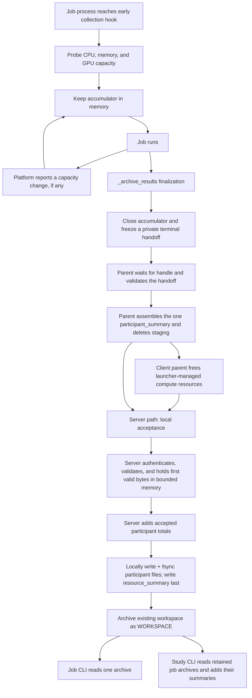

# Job resource statistics: Phase 1 implementation plan

Status: production subset implemented; remaining target behavior is still a
design proposal.

This plan describes a small, current-code implementation. Each participating
site contributes one final resource report. A client parent transmits its
report; the server parent accepts its own report locally. The server combines
the accepted reports into a job summary, stores the result in the job's
existing archived workspace, and serves job and study views through the CLI.

The design does not depend on the planned GPU-release work. It describes how
NVFlare works today and leaves one narrow integration point for a future
resource manager.

For a strict description of the code in this branch, including limitations,
read the
[production implementation walkthrough](../../research/runtime_resource_proxy_prototype/PRODUCTION_IMPLEMENTATION.md).
In particular, retained-content collection, client retries/tombstones, and
the versioned completion-topic fallback described later in this plan are not
implemented. F3 collection and rollup are implemented; a new live process-mode
reference is still needed. The exact current outputs are in
[production_reference](../../research/runtime_resource_proxy_prototype/production_reference/README.md).
A real PyTorch Process-launch POC that exercised CUDA training, child launch,
CellNet delivery, normal workspace storage, and the job/site/study CLI is
captured separately in the
[PyTorch Colossus E2E reference](../../research/runtime_resource_proxy_prototype/colossus_pytorch_e2e_reference/README.md).

## 1. Decisions in this version

1. Each participant has exactly one persisted and, for a client, transmitted
   `participant_summary`. The parent assembles it after the job handle ends;
   the job process supplies only a private terminal measurement handoff.
2. The public record has no start/final pair, attempt records, attempt IDs,
   environment keys, end reasons, stability checks, or raw measurement
   periods.
3. CPU, memory, and GPU capacity-time appear in one `resource_time` object
   with one overall measurement status. Phase 1 does not persist the raw
   capacity snapshot behind each private interval. A future Phase 2 contract
   may keep periodic snapshots without changing this v1 terminal record.
4. The current adapter keeps an in-memory accumulator from the early hook
   before workspace download, custom-path activation, and application-runner
   setup until `_archive_results()` before workspace upload. Official Process,
   Docker, Kubernetes, and Slurm workers enter a fixed NVFlare bootstrap with
   Python `-I` and a literal `client` or `server` selector. The effective
   startup path excludes job custom code; after the snapshot NVFlare enables
   normal app/site imports. Nothing is persisted at the opening hook. At the
   end it freezes one private handoff for its parent.
5. The current adapter assumes the capacity visible at startup remains in
   effect until finish. A platform component may explicitly report a capacity
   change to the accumulator.
6. A future GPU acquire/release implementation must account for each change.
   It may notify the current accumulator, or replace the collection adapter if
   workers become transient. The final record and rollup do not depend on that
   process choice. No implementation may multiply one end-of-job snapshot by
   the whole duration.
7. Visible workspace-filesystem capacity is observed once, at finalization.
   It is not time-integrated or aggregated across sites.
8. Saved-result bytes (`retained_content`) and selected F3 traffic remain
   separate typed final measurements. Retained content currently reports
   `unavailable/not_bound` until an authoritative result owner is bound. F3
   uses implemented parent/child counters and checked merge.
9. The client parent sends the exact parent-assembled bytes and terminal
   outcome once in the existing session-bound `REPORT_JOB_FAILURE` CellNet
   request. There is no application-level report retry or receipt tombstone.
   A versioned `REPORT_JOB_COMPLETION` with the same outcome and report remains
   an unimplemented fallback if review rejects the historical name. The server
   parent sends its assembled bytes through local acceptance without a
   loopback message.
10. The server stores the reports and rollup only in the existing server job
    workspace. The normal `WORKSPACE` archive is the only stored copy. Normal
    multi-root packaging is unchanged; the reader fails closed if flattening
    produces a duplicate, missing, staging, or extra `resource_stats/` member.
11. The CLI supports one retained job and an on-demand aggregate over retained
    jobs in one study. `--job` selects one job, while `--study` alone selects a
    study rollup. A job query without `--study` uses the `default` study.
12. The implementation requires no new privilege, mount, sidecar, service,
    user-supplied launcher argument, environment variable, job option, or
    operator setting. The isolated Python flag and startup environment
    sanitation are internal launcher behavior.

## 2. What this measures

The feature answers two questions:

- What capacity-time was visible during each participant's implemented
  application-run window?
- Once their authoritative hooks exist, how much selected job traffic and
  retained output did NVFlare observe?

It does not claim scheduler reservations, physical-machine capacity, actual
CPU/GPU utilization, energy, ownership, cost, or billable usage. The values are
ordinary-user observations made inside the job environment.

The job total deliberately adds participant values. If two jobs overlap on
the same hardware, each job reports its own visible capacity-time. A study
total then adds both jobs. It must not be labeled cluster capacity.

The current adapter covers the window from the early platform hook before
workspace download, custom-path activation, and application-runner setup to
`_archive_results()` before workspace upload. The final reading currently
follows the callback pre-drain and child F3 drain, so it includes their actual
elapsed cleanup tails. Both are condition waits that normally return
immediately and are individually bounded by five seconds; the optional
post-stop callback wait is after publication and excluded. The interval also
includes other waiting inside that window, but not the whole operating-system
process lifetime. It is not active-task time. Job and study
`measured_seconds` add participant durations, so they can exceed job or study
wall-clock elapsed time.

## 3. End-to-end flow



There is one final report, not a stream of public records. The startup probe
and any capacity-change notifications are private accumulator inputs and do
not appear in the archived JSON.

## 4. Why one final report is simpler

Removing public start and end records eliminates correlation, reconciliation,
and status fields that existed only to join those records. It also removes the
need to retain raw periods so the server can repeat the arithmetic.

The resulting participant record needs only:

- identity and schema fields;
- one `resource_time` result;
- one final workspace-filesystem capacity observation;
- one retained-content result; and
- one final F3 result.

The tradeoffs are important:

- A hard child-process or launcher-managed pod failure can remove child
  measurements. If the parent survives, it still creates one report with typed
  unavailable or partial values; it does not guess. Loss of the parent/site can
  still leave the expected participant without a report.
- The server can validate the final values and their bounds, but it cannot
  recompute capacity-time from raw periods that are no longer present.
- For a complete participant report, dividing resource-time by
  `measured_seconds` gives a time-weighted average capacity. It recovers the
  original capacity only when that capacity stayed constant, and it cannot
  show when capacity changed. Dividing job or study totals by their summed
  participant durations is not physical cluster capacity.
- Current code does not announce resource changes while a job process is
  running. Its initial CPU, memory, and GPU observations are therefore assumed
  to remain valid until finish.
- The current collection adapter assumes that one CJ/SJ process survives for
  the participant. A future design with transient workers or CP/SP task
  execution must move collection to an existing platform-owned lifetime that
  spans the participation. This changes the adapter, not the stored format.
- A future dynamic resource manager must account for every acquire, release,
  or reconfiguration boundary. Silently sampling only at the end would produce
  incorrect capacity-time.
- A rank-0 process cannot observe other nodes in a Slurm multi-node launch.
  Until a multi-node collector exists, production discards rank-zero numeric
  resource-time totals and reports `unavailable/unsupported` rather than a
  partial or claimed whole-participant total.
- F3 now uses process-local child and parent counters with one fixed cutoff and
  checked merge. Its remaining proof gap is a fresh process-mode live run, not
  an undefined counter or schema.
- If an applicable cgroup CPU or memory constraint is unreadable or malformed,
  that dimension fails closed instead of falling back to a wider value.
- A restored server job process covers only its new process interval. Numeric
  values remain useful, but `partial/observation_incomplete` records the
  missing pre-restore interval.

These tradeoffs are acceptable for a small first version as long as the final
totals are described as authenticated participant self-reports, not immutable
or independently reconstructed evidence.

## 5. Canonical records

The JSON Schema and semantic contract are authoritative for exact types,
bounds, nullability, versioning, and privacy rules. This section explains the
shape without duplicating every constraint.

### 5.1 Participant summary

Each accepted participant contributes one object:

```text
participant_summary
├── schema_version
├── kind
├── job_id
├── participant_name
├── reported_at
├── resource_time
│   ├── status
│   ├── issues (partial/unavailable only)
│   ├── measured_seconds
│   ├── cpu.groups[].unit_seconds
│   ├── memory.byte_seconds
│   └── gpu.groups[].instance_seconds
├── workspace_filesystem
│   ├── status
│   └── capacity_bytes (reported only)
├── retained_content
└── f3
```

`resource_time.status` applies to CPU, memory, and GPU together. The supported
measurement outcomes are:

| Status | Meaning |
| --- | --- |
| `reported` | The accumulator covered the reported duration and obtained all three resource dimensions. |
| `partial` | At least one resource dimension or interval was not measured, but some valid capacity-time remains. |
| `unavailable` | No usable CPU, memory, or GPU capacity-time could be produced. |

The record carries a short issue list only for `partial` or `unavailable`.
It does not repeat a separate status under CPU, memory, and GPU.

`measured_seconds` is the non-overlapping duration covered by the in-memory
accumulator. It is not reconstructed from public timestamps.

CPU totals are grouped by the exact CPU evidence and model fields defined in
the schema. GPU totals are grouped by device kind and model. This preserves
heterogeneous hardware without putting raw device identifiers in the report.
MIG groups are omitted when no MIG instance applies.

### 5.2 Job summary

When a job proceeds after deployment, the server records the original selected
client list before start requests, independently of received reports. It writes
one entry for every selected client and one for the server. A deployment
failure or later start timeout does not remove that expected entry; a client
that never ran therefore remains visible as `missing`.
The selected client names are persisted in job metadata as
`JobMetaKey.RESOURCE_PARTICIPANTS`, so root-parent restore can rebuild the same
denominator. Accepted reports, invalid history, and cutoff state are
not restored; pre-restart accepted reports normally become `missing` because
the current client does not retry.
Each entry is `accepted`, `missing`, `invalid`, or `disabled` and points to an
accepted participant file when one exists.

The job `resource_summary` adds accepted participant values:

```text
job measured seconds       = sum(participant measured seconds)
job CPU unit-seconds       = sum(participant CPU unit-seconds)
job memory byte-seconds    = sum(participant memory byte-seconds)
job GPU instance-seconds   = sum(participant GPU instance-seconds)
job retained bytes         = sum(participant retained bytes)
job F3 remote-accepted bytes/messages = sum(participant remote-accepted values)
```

It never adds workspace-filesystem capacity. That is a point-in-time property
of a filesystem that may be shared by several participants.

### 5.3 Study summary

A study query materializes the caller-visible job IDs and statuses from one
job-store scan. It then reads each terminal job's validated `resource_summary`
and adds the same additive fields used by the job rollup. This gives the query
a stable work list; it is not an atomic snapshot of the job store.

```text
study_summary
├── schema_version and kind
├── selection.study_name
├── generated_at
├── coverage
│   ├── selected_jobs
│   ├── included_jobs
│   ├── unavailable_jobs
│   └── nonterminal_jobs
├── jobs[]
│   ├── job_id and job_status
│   ├── resource_data: included, unavailable, or nonterminal
│   └── totals (included only)
└── totals
```

The study result records every job in that materialized work list as:

- `included` when a valid resource summary was read; or
- `unavailable` when the job is terminal but its workspace or resource bundle
  is absent or invalid.

Jobs that are not terminal at scan time are listed as `nonterminal` but
excluded from additive totals. They do not contribute partial values.

The study view is calculated on demand from retained job archives. It is not a
billing ledger and cannot include jobs or workspaces that have been deleted.

## 6. Resource-time accumulator

### 6.1 Internal API

The implementation exposes a small platform-owned API:

```python
resource_collector = JobResourceCollector(run_dir)

# Current code runs the job. A future resource manager may call:
resource_collector.observe_capacity_change(new_capacity)

handoff = resource_collector.finish()
```

The supported platform API does not accept timestamps, totals, status, models,
device counts, or issue codes from application code. This is an API boundary,
not tamper-proof isolation: code in the same process can still affect visible
sources or alter the private handoff.

During `JobResourceCollector(...)` construction, the accumulator:

1. takes the initial CPU, memory, and GPU observations;
2. records a monotonic clock anchor; and
3. holds all state in memory.

At `observe_capacity_change()` it:

1. takes a new monotonic timestamp;
2. multiplies the previous capacity by the elapsed time;
3. adds the contribution using checked integer/decimal arithmetic; and
4. installs the new capacity for the next interval.

At `finish()` it performs the same integration through the final monotonic
timestamp and finalizes one `resource_time` object. It does not perform a public
end-capacity stability check.

Convert monotonic nanoseconds to seconds with at most nine fractional digits.
For each private interval, multiply each selected capacity by that interval's
seconds and round the product at most once to nine fractional digits using
round-half-even before adding it to its compatible group. All additions use
checked exact decimal arithmetic; floats are not serialized.

`measured_seconds` derives only from the monotonic clock, so a wall-clock
adjustment cannot make resource time negative or inflated. The parent records
`reported_at` when it serializes the terminal report; the server independently
records receipt, cutoff, and finalization times.

### 6.2 Current-code behavior

Today no NVFlare component reports a mid-job resource change to this
accumulator. The current adapter therefore has one private interval: the
initially visible capacity is assumed to remain until `_archive_results()`.

This is a stated assumption, not a claim that allocations can never change.
The design remains compatible with future GPU release because the stored
result is an accumulated total rather than an end snapshot. When that work is
implemented, a surviving collector owner can call
`observe_capacity_change()` at
each ownership change. If workers become transient, the collection adapter
must instead move to an existing platform component whose lifetime spans the
logical participant. The one final record and its rollup remain unchanged.

For current Slurm multi-node launches, the NVFlare worker probe sees rank 0 but
not launcher-owned commands on other nodes. Phase 1 therefore emits
`resource_time: {status: unavailable, issues: [unsupported]}` and publishes no
rank-zero numeric resource-time totals. It does not label rank-0 capacity as
either partial or complete multi-node capacity.

### 6.3 Failure rules

- Probe and arithmetic failures do not fail the federated job.
- A missing dimension makes the one overall `resource_time.status` partial
  when other valid totals remain.
- An unreadable or malformed applicable cgroup CPU or memory constraint makes
  that dimension unavailable; the probe never substitutes a wider affinity,
  online-CPU, or physical-memory value.
- A restored server collector marks its post-restore result
  `partial/observation_incomplete` even when every new-process probe succeeds.
- If the accumulator cannot establish any usable measurement, status is
  unavailable.
- Checked arithmetic rejects negative, non-finite, or out-of-bound totals.
- Contributions never overlap within one participant accumulator.
- The private terminal handoff is written once. No recoverable startup
  fragment is promised after SIGKILL, pod loss, or node loss. A surviving
  parent still assembles a public report and marks missing child-derived data
  unavailable.

## 7. Exact collection rules

All probes use ordinary-user APIs inside the job process. Diagnostic commands
below help an operator understand a value; the implementation should use
native APIs and parsers rather than shelling out.

### 7.1 CPU

The effective CPU-unit count is the minimum applicable positive limit from:

1. `os.sched_getaffinity(0)` where supported;
2. the effective cpuset for the process's actual cgroup, including inherited
   ancestor constraints;
3. the effective CPU quota divided by its period, including the tightest
   ancestor quota; and
4. online logical processors as fallback.

A quota ratio is calculated with exact decimal arithmetic and conservatively
floored to at most nine fractional digits so it never exceeds the kernel
limit. It is not rounded up to a whole CPU. `online_count` is diagnostic
evidence, not an additional capacity to add.

Once an applicable cgroup cpuset or quota is found, an unreadable or malformed
value fails the CPU dimension closed. Do not fall back to affinity or online
processors, because either may be wider than the constraint that could not be
interpreted.

CPU model is read from homogeneous processor records exposed to the process.
If visible records disagree, omit the model; model omission alone is not a
compute-accounting issue. Never choose one model to represent a heterogeneous
visible CPU set. Architecture comes from the platform machine value after
normalization.

Useful diagnostics:

```bash
taskset -pc $$
getconf _NPROCESSORS_ONLN
cat /proc/self/cgroup
cat /proc/self/mountinfo
lscpu
```

### 7.2 Memory

Visible memory bytes are the minimum of:

1. physical memory visible through `SC_PHYS_PAGES * SC_PAGE_SIZE`; and
2. the tightest finite memory limit on the process's actual cgroup path and
   applicable ancestors.

Unlimited sentinels are ignored. Swap is not added. This is visible capacity,
not peak resident memory or bytes actually touched.

Once an applicable cgroup memory limit is found, an unreadable or malformed
value fails the memory dimension closed. Do not substitute physical memory,
because it may exceed the unknown effective limit.

Useful diagnostics:

```bash
getconf PHYS_PAGES
getconf PAGE_SIZE
cat /proc/self/cgroup
cat /proc/self/mountinfo
```

### 7.3 GPU

A numeric GPU count requires successful CUDA Runtime enumeration. A raw
`CUDA_VISIBLE_DEVICES` string and `nvidia-smi` output are diagnostic only.
NVML may enrich CUDA-validated devices with a normalized model; it does not
create a count on its own.

Full GPUs and MIG instances are separate groups. MIG fields are absent when
MIG does not apply. Raw UUIDs, serial numbers, bus addresses, and hostnames are
not persisted.

The original PyTorch run exposed one portability gap within this rule. A
driver-only host can make `libcuda` and NVML available system-wide while an
installed NVIDIA Python distribution supplies `libcudart` outside the dynamic
loader's default search path. The current collector closes that specific gap
without importing PyTorch or changing the GPU authority rule.

When the trusted collector module is imported, it freezes the absolute Python
distribution roots that are visible before job custom paths are activated. If
normal CUDA Runtime loading or enumeration fails, it searches installed
distribution metadata under only those frozen roots and accepts files owned by
an allowlisted `nvidia-cuda-runtime` or `nvidia-cuda-runtime-cuNN`
distribution. A candidate must resolve to a nonempty regular file contained in
that distribution's installation root. Contained aliases and hard links to the
same target are deduplicated; more than one distinct target is ambiguous and
fails closed. The one unique target is loaded by absolute path with
`RTLD_LOCAL | RTLD_NOW` on POSIX, and the normal `cudaGetDeviceCount` plus CUDA
Driver UUID and NVML matching path continues unchanged.

This lookup adds no environment change, setting, privilege, subprocess,
framework import, or persisted path/hash/manifest. If metadata is missing,
malformed, outside the frozen roots, not allowlisted, or ambiguous, GPU remains
unavailable and otherwise valid CPU/memory totals make resource time partial.
Legacy runtimes owned directly by a `torch` distribution and conda-only
layouts are intentionally outside the initial adapter; they remain safely
partial until a separately validated metadata adapter is added. Broader
platform, CUDA-version, visible-subset, multi-GPU, and MIG validation also
remains required.

Useful diagnostics:

```bash
python -c 'import os; print(os.environ.get("CUDA_VISIBLE_DEVICES"))'
nvidia-smi -L
```

### 7.4 Visible workspace-filesystem capacity

At finalization, call `os.statvfs()` on the filesystem containing
`Workspace.get_run_dir(job_id)` and record:

```text
capacity_bytes = f_blocks * f_frsize
```

Do not enumerate mounts, sum filesystems, calculate storage byte-seconds, or
aggregate this value across participants or jobs. It is the visible capacity
of the workspace filesystem, not storage owned, used, allocated, or billed to
the job.

Useful diagnostic:

```bash
df -B1 <job-run-directory>
```

### 7.5 Retained content

`retained_content.bytes` is the size of a bounded result set that NVFlare
already identifies as retained output. Do not scan arbitrary workspace files,
guess model filenames, or hash `model.pt`. If a workflow has no authoritative
bounded result set, report retained content as unavailable.

### 7.6 F3 network counters

F3 is sender-counted, origin-only, and job-scoped. It includes exactly three
classes:

- one job application/deployment send per remote destination;
- a response that contains a real task; and
- a submitted task result.

Task polls, empty or control responses, acknowledgements, protocol control,
workspace transfer, the resource report itself, authentication, heartbeat,
shutdown, logs, HCI, federated events, and unclassified traffic are excluded.
An intermediate relay never counts the operation again.

F3 counters are process-local. Phase 1 therefore keeps one job-scoped counter
in the parent and one in the job process. The child freezes its contribution
into the private handoff. After the job handle finishes, the parent closes
admission and freezes immediately, then adds compatible parent and child fields
with checked arithmetic. CP originates no included class and SP's blocking
deployment sends have already completed; a parent admission still pending at
cleanup is therefore marked `counter_gap` instead of delaying publication.

The child's five seconds is a maximum, not an unconditional sleep. Its callback
and F3 drains use condition variables and return immediately when no work is
pending. The waits occur only during job-process terminal cleanup, so they add
no polling or steady-state job overhead. Five seconds is an internal constant,
not a job or operator setting.

An incomplete drain or missing contribution is not guessed. If at least one
bounded contribution is useful, merged F3 is partial with the applicable
issue. If none is useful, F3 is unavailable. This does not change the separate
compute, retained-content, or workspace results.

F3 counts one logical operation at its trusted semantic origin, once per
remote destination. A remote logical destination reached through a local
first-hop relay still counts once at the origin; the relay does not add a
second contribution. Retries and stream chunks do not add messages or repeat
bytes. When provenance or settlement cannot be proved, the affected operation
is discarded and F3 is partial rather than guessed.

The main payload is measured after FOBS encoding and before optional
encryption. Successfully accepted unique `DownloadService` bytes are folded
into their originating operation without another message. Remote bytes enter
the public value only after local transport acceptance. Direct final
in-process delivery and sends that fail before acceptance do not contribute.

Production freezes child F3 counters once in `_archive_results()`, after new
application-command admission has stopped and before workspace upload.
Cleanup first gives already-admitted command callbacks up to five seconds to
finish while Cell and streaming remain available. A timeout or error marks the
child contribution `partial/counter_gap` rather than publishing a complete
undercount. It then closes F3 admission, drains pending logical sends for up to
five seconds, and freezes before transport shutdown.

The real-task-response binding pre-admits its known origin/destination pair
before the command callback returns. The later Cell path reuses that token and
still supplies the post-FOBS byte count and actual acceptance result. This
closes the callback-return/send-start race without counting early.

The parent counter starts before that parent can originate any included
traffic. CP freezes it after `job_handle.wait()` and before sending the
terminal report. SP freezes it after the server handle finishes, before it
assembles its local participant report. Any unexpected pending parent operation
produces `counter_gap` immediately; later completion cannot mutate the frozen
result. The terminal resource report and workspace transfer remain excluded.

The exact current route bindings and remaining proof gaps are in
[Phase 1 integration with current code](../../research/runtime_resource_proxy_prototype/CURRENT_CODE_INTEGRATION.md).

## 8. Current and target process hooks

When the job proceeds after deployment, the server records every originally
selected client's existing registered site name plus the server name. Only the
deployable subset is launched, but a deployment failure or later start timeout
does not remove a selected participant from resource coverage. No resource-specific
identity, HMAC secret, request header, launcher input, environment variable, or
deployment setting is added. On a client completion request, the server
derives the participant name from the authenticated sender and job context;
it does not trust a name merely because it appears in JSON. SP uses `server`.

The child writes its bounded internal handoff atomically at:

```text
<run_dir>/resource_stats/staging/terminal_handoff.json
```

It contains terminal resource time, the workspace-filesystem observation, and
typed retained-content and child-F3 objects. The last two are currently
`unavailable/not_bound`. It is not a public
`participant_summary`, is never renamed into `participants/`, and never enters
the final resource namespace or retained job-store archive. The parent supplies trusted
identity and assembles the public record. A missing or invalid handoff produces
typed unavailable or partial fields in that record; it is not a reason to
invent measurements or skip parent assembly.

Its exact private fields are:

```text
internal_version = "1"
kind = "nvflare.resource_stats.internal.terminal_handoff"
resource_time
workspace_filesystem
retained_content
child_f3
```

It contains no job or participant identity.

For a separate-workspace launcher, this handoff can travel in the existing
transient result-workspace ZIP so the parent can read it. That transfer bundle
is not the retained server `WORKSPACE` archive; the parent deletes staging
before final archival.

The parent reads only that fixed path. It requires a regular, non-symlink file,
checks the 1 MiB bound before decoding, and applies strict UTF-8 JSON,
duplicate-key, finite-number, exact-number, internal-version, and semantic
bounds. Unknown fields are rejected.

| Action | Current location | Required behavior |
| --- | --- | --- |
| Record participant list | `private/fed/server/job_runner.py`, before server/client start requests | **Implemented:** preserve the server and every originally selected client; persist client names in `JobMetaKey.RESOURCE_PARTICIPANTS`; failed deployment and later start timeout leave that client visible as `missing`; restore rebuilds the expected set from metadata. |
| Start server-parent F3 | `private/fed/server/job_runner.py`, after scheduling and before `_deploy_job()` | **Implemented:** create a trusted job-scoped counter before the first included deployment send. |
| Start client-parent F3 | `private/fed/client/client_executor.py::start_app()`, after authoritative `START_JOB` metadata is validated against deployed metadata and before launcher selection or launch | **Implemented:** create a trusted job-scoped counter before launching the job. The current three-class allowlist normally gives CP a zero contribution. |
| Official launcher bootstrap | Process, Docker, Kubernetes, and Slurm launchers | **Implemented:** invoke a fixed NVFlare bootstrap with Python `-I` and an exact `client` or `server` selector, keeping job custom paths out of the effective startup path; this is automatic and needs no user setting or extra privilege. |
| Client accumulator start | `private/fed/app/client/worker_process.py`, after `Workspace` construction and before workspace download or `activate_job_python_path()` | **Implemented:** probe CPU, memory, and GPU and start in-memory accumulation. CUDA Runtime discovery may use one unique metadata-owned NVIDIA runtime under the import-time frozen distribution roots. Persist nothing. |
| Server accumulator start | `private/fed/app/server/runner_process.py`, at the equivalent point | **Implemented:** same behavior. |
| Client child handoff | client `worker_process.py::_archive_results()`, after runner return and before F3 streaming shutdown/workspace upload | **Implemented:** finish the accumulator, observe workspace capacity, freeze child F3, keep retained content unavailable until it has an authoritative owner, and atomically write one private handoff. |
| Server child handoff | server `runner_process.py::_archive_results()` | Same behavior. |
| Client parent assembly and delivery | `private/fed/client/client_executor.py`, after `job_handle.wait()` | **Implemented:** close and freeze parent F3 immediately, validate the handoff, checked-merge child and parent F3, assemble canonical bytes even when child data is unavailable, delete staging, free launcher-managed compute resources, then attach those exact bytes to one `REPORT_JOB_FAILURE` request and wait for its reply. |
| Server acceptance | `private/fed/server/fed_server.py::process_job_failure()` | **Implemented:** authenticate and put the optional report in the bounded live ledger before resolving the outcome, without changing the job outcome. Participant files are written only at finalization. `process_job_completion()` is target-only fallback. |
| Server parent assembly and rollup | `private/fed/server/job_runner.py::_job_complete_process()`, after the server handle finishes and before `_save_workspace()` | **Implemented:** close and freeze parent F3, validate the SJ handoff, checked-merge both F3 contributions, assemble canonical bytes, accept locally, delete staging, close the client cutoff, write accepted participant files, publish the summary last in the parent-owned workspace, then use normal workspace archival. |

The Process command is `<sys.executable> -I <absolute platform
job_process_bootstrap.py> {client|server} <existing args>`. Docker,
Kubernetes, and Slurm use `<configured python> -I -u -m
nvflare.private.fed.app.job_process_bootstrap {client|server} <existing
args>`. The historical executable-module value is exact-allowlisted only to
choose one selector; it is never copied into the command, and any other value
fails before launch.

Python isolated mode ignores `PYTHONPATH` during interpreter startup. The
worker takes the initial snapshot before downloading the job workspace and
then calls `activate_job_python_path()` to enable preserved dependency paths
and app/site custom imports for normal execution. A bring-your-own-container
entrypoint can still run before the launcher-supplied Python command, and a
`sitecustomize` installed in global interpreter site packages can still run
under `-I`. Job code also shares the process after the snapshot. Child-derived
values are therefore authenticated self-reports, not tamper-proof evidence.
Parent identity and F3 bookkeeping do not turn the hardware observations into
attestation.

## 9. Client completion transport: primary and fallback

### 9.1 Implemented Option A behavior

The current client parent already sends one optional request after every job
child exits, including a successful exit:

| Item | Current value |
| --- | --- |
| Call site | `ClientExecutor._wait_child_process_finish()` |
| Target | `FQCN.ROOT_SERVER` |
| Channel | `CellChannel.SERVER_MAIN` (`task`) |
| Topic constant and wire value | `CellChannelTopic.REPORT_JOB_FAILURE` / `report_job_failure` |
| Payload keys | `JobFailureMsgKey.JOB_ID`, `CODE`, `REASON`, and optional `RESOURCE_REPORT` |
| Server registration and handler | `FedServer` registers `FedServer.process_job_failure()` on that topic |
| Timeout | existing `job_query_timeout`, currently five seconds |

Despite its historical name, this request carries both successful and failed
terminal outcomes. Current code sends it once with the optional bounded
report, compares canonical bytes directly on the server, retains the first
accepted bytes in the bounded live parent ledger, and returns a flat
`resource_report_status`.
It does not write a participant file at acceptance, retry the request, or
retain a receipt tombstone. `process_job_failure()` authenticates the
registered client session, processes the resource report, applies a failure or
abort action when appropriate, and resolves that client's pending outcome.

The implementation keeps the same target, channel, timeout, and trust boundary. In
secure mode, the incoming Cell filter validates the signed token and binds it
to the message origin before the selected handler runs. In insecure mode, the
handler retains the existing registered-session-token check but has no
signature or hardware attestation.

### 9.2 Implemented contents; common shape for the fallback

Option A carries the following terminal outcome and optional report in one
request. Option B would retain the same fields:

```text
{
  "job_id": string,
  "code": integer,
  "reason": string or null,
  "resource_report": {                 # optional
    "participant_summary": bytes       # canonical UTF-8 JSON, at most 1 MiB
  }
}
```

Option B also requires a top-level `"protocol_version": 1`; option A does not
add that field to the legacy envelope. It must be the exact JSON integer `1`,
not a string or Boolean. The optional report has the same schema, size bound,
reply statuses, idempotency behavior, and cutoff under either option. The
outcome is still sent when the report is omitted. The implemented Option A
reply body is flat:

```text
{
  "resource_report_status": "accepted" | "duplicate" | "invalid" |
                            "conflict" | "too_late" | "not_provided" |
                            "not_expected" | "server_error"
}
```

### 9.3 Option A (primary): extend `REPORT_JOB_FAILURE`

Option A retains `CellChannelTopic.REPORT_JOB_FAILURE = "report_job_failure"`,
the `JobFailureMsgKey` outcome keys in `private/defs.py`, the existing callback
registration, and `FedServer.process_job_failure()`. It adds
`JobFailureMsgKey.RESOURCE_REPORT = "resource_report"` plus the common nested
report and reply keys, and extends that handler to invoke the shared
report-acceptance routine before the once-only terminal-outcome action.

This is the implemented choice because it changes the existing one-message
completion exchange instead of adding another protocol surface. Its drawback
is ownership and naming: a handler and constants historically labeled
"failure" now explicitly own all completion outcomes plus resource reporting.

### 9.4 Option B (fallback): add versioned `REPORT_JOB_COMPLETION`

If reviewers reject extending the historically named request, option B adds:

- `CellChannelTopic.REPORT_JOB_COMPLETION = "report_job_completion"`;
- `JobCompletionMsgKey` in `private/defs.py`, with
  `PROTOCOL_VERSION = "protocol_version"`, `JOB_ID = "job_id"`,
  `CODE = "code"`, `REASON = "reason"`, and
  `RESOURCE_REPORT = "resource_report"`, plus the common nested report and
  reply keys; and
- a `FedServer.process_job_completion()` callback registered on the new topic.

The client sends `protocol_version: 1`. The new handler rejects unsupported
versions before mutation, then delegates to the same shared report-acceptance
and terminal-outcome routine as option A. This remains one completion request;
it is not a resource-only message sent in addition to the legacy request.

Option B fixes the misleading name and gives completion-envelope ownership a
clean version boundary. It does **not** address objections to putting resource
work on the synchronous completion path. The same potentially large payload,
pre-acknowledgement size enforcement, direct canonical-byte comparison, strict
JSON/schema validation, bounded in-memory ledger insertion, reply handling, and
whole-request retries remain in the critical job-completion path.
Participant-file write and flush remain finalization work under either option.
A reviewer who requires lifecycle control and resource transport to be
separated will reject both options.

### 9.5 Selection and compatibility

Current production selects Option A unconditionally. If Option B is implemented
for mixed-version rollout, Phase 1 must select exactly one option for each
client completion before the first attempt. Any future retries use that same
topic, envelope, and bytes.
The client must not send both topics, must not switch topics after an ambiguous
timeout, and must not use the legacy outcome request as a second fallback after
sending the new request. Dual-send could resolve the outcome twice, create two
acknowledgement races, and make the resource receipt ambiguous.

Selection requires no operator setting, job option, launcher argument, or new
deployment configuration. Existing registration already exposes federation
protocol and NVFlare versions, so implementation may make a release-level
choice or use an existing version/capability signal. The exact rollout and
mixed-version capability rule remains an implementation decision. It must be
decided before enabling either transport: an old server may ignore option A's
unknown optional field and cannot acknowledge report acceptance, while it does
not have option B's topic. The terminal path must not probe support by sending
both requests.

### 9.6 Target retry and receipt behavior (not implemented)

The remainder of this subsection is a possible follow-up design. Current CP
makes one application-level send, and SP retains neither a receipt tombstone
nor restart-restorable acceptance state.

After the child handle finishes, CP closes and freezes its parent F3 counter
immediately, validates the private handoff, and assembles canonical bytes. A
missing or invalid handoff normally produces a valid report with typed
unavailable or partial fields.
CP keeps those exact parent-assembled bytes in memory for the bounded retry
loop. It omits the optional report only if parent assembly fails, the final
bytes exceed the bound, or they cannot fit the effective Cell payload limit;
it still sends the terminal outcome.

The client makes at most three attempts on the selected transport, using the
existing timeout and one second between attempts. It retries only a missing
reply or transport failure and sends the same outcome and bytes. An explicit
resource-report status ends the retry. Resource reporting never changes the
job return code.

The server keeps the accepted canonical bytes only in the bounded live parent
ledger. While that live state exists, a lost-reply retry can receive
`duplicate` through a direct byte-for-byte comparison, including after cutoff.
Once the job leaves `running_jobs` and the live state is cleaned up, a retry is
too late and cannot reopen the archived result. There is no post-finalization
receipt tombstone or second statistics store.

Other alternatives were rejected for these reasons:

| Mechanism | Main problem for the final report |
| --- | --- |
| Separate resource-only CellNet topic | Creates a second message, acknowledgement, and cutoff race without improving trust. Option B above is different: it replaces, rather than accompanies, the legacy completion request. |
| CJ-to-SJ Aux request | Job cells are tearing down and a crashed client job cannot send. |
| Federated event | Delivery is best effort and not a durable acceptance acknowledgement. |
| Task or model metadata | Some jobs have no final model/task result; filters, retries, and workflow teardown make it unreliable. |
| Server pull | Requires client job cells to remain alive and couples finalization to today's process topology. |
| Workspace only from every client | The server archive does not automatically contain every client's workspace, and the server lacks an authenticated readiness signal. |
| Separate `RESOURCE_STATS` component | Duplicates data already in `WORKSPACE` and creates consistency problems. |

## 10. Server acceptance, cutoff, and rollup

### 10.1 Acceptance

The implemented Option A handler processes the optional report before it
processes the terminal outcome. Option B's `process_job_completion()` remains
a target fallback that would delegate to the same internal routine. After
authentication and expected-client binding, report
acceptance/replay runs even when that client's terminal outcome was already
resolved. The terminal success/failure/abort action itself remains once-only.
This ordering allows a duplicate request to reach live acceptance state even
after the terminal outcome was resolved. Current CP does not issue that retry.

The server performs these steps:

1. Bind the request to the authenticated client and expected job.
2. Enforce the byte limit before JSON decoding.
3. Parse strict UTF-8 JSON, rejecting duplicate keys and non-finite numbers.
4. Validate the schema, semantic bounds, job identity, participant name,
   allowed hardware groups, and canonical arithmetic representation.
5. Accept the final `resource_time` totals as parent-assembled values derived
   from the participant's private child handoff. The server cannot recompute
   them because raw periods are not transmitted.
6. Under the per-job lock, compare the canonical bytes directly with any
   previously accepted bytes for that participant. Retain the first valid
   canonical bytes and receipt time in the bounded root-parent memory ledger,
   then acknowledge acceptance.

Each report is capped at 1 MiB, and the sum of accepted canonical report bytes
held for one live job is capped at 64 MiB. Acceptance performs no participant
file write or fsync. `accepted` therefore means validated and held in live
parent memory; it is not a restart-durable acknowledgement.

The first valid canonical byte sequence wins. An exact byte-for-byte retry is
an idempotent duplicate while live acceptance state exists; there is no receipt
tombstone. Different valid canonical bytes before cutoff are a conflict and do
not overwrite the first. Invalid candidates do not reserve the participant
slot. New bytes after cutoff are too late.

The terminal outcome is processed even if resource validation or persistence
fails. The resource result cannot make a successful job fail or a failed job
succeed.

For the server job, SP validates the SJ handoff and assembles deterministic
bytes with the trusted server participant name. F3 is currently
`unavailable/not_bound`; the parent/child merge remains target work. SP passes
those bytes through the same acceptance function, which performs the same
direct byte comparison, instead of sending a loopback message. It then removes
the handoff and empty staging directory whether local acceptance succeeded or failed.
Staging is not a public record and is not included in the final job archive.

### 10.2 Cutoff

When `_job_complete_process()` observes that the server job has exited, its
job handle has already completed. SP then performs the local assembly
described above. Missing or invalid SJ handoff data becomes
typed unavailable or partial data in one SP-built report; SP does not guess.
The one local acceptance attempt puts the final canonical bytes in the same
bounded live ledger as a client report. The private handoff is deleted, not
moved to a public participant path.

Normal completion then reuses the existing client-outcome wait. The server
does not open a second reporting window. After every current terminal client
outcome arrives or the existing timeout expires, it closes resource
acceptance. Abort and server-process failure use the existing immediate path:
SP performs the same bounded local assembly and acceptance, skips the client
wait, and closes acceptance immediately. A server-process failure never waits
out the normal 900-second client-outcome grace period.

Acceptance and cutoff share one per-job lock, so a live-ledger insertion cannot
race finalization and publication.

### 10.3 Rollup and archive

After cutoff, the server:

1. snapshots the participant list fixed before start requests and the internal
   accepted canonical-byte ledger;
2. uses those validated canonical bytes without trusting a child-side file,
   classifies every expected participant, and adds accepted final totals without
   reconstructing them;
3. confirms that `resource_stats/staging` is absent;
4. writes and fsyncs the exact accepted participant bytes through parent-owned
   descriptors;
5. writes and fsyncs `resource_summary.json` atomically last in the parent-owned
   local construction directory as the publication marker; and
6. calls the existing workspace-save path for the normal `WORKSPACE`
   component.

Participant classification is exact: a report in the live accepted ledger is
`accepted`; an identical retry or later conflict does not change it. With no
accepted report, `invalid` requires at least one correctly bound, pre-cutoff
candidate that failed report validation (`malformed_source`). `not_provided`,
`too_late`, authentication/binding rejection, and `server_error` otherwise
produce `missing`. Existing platform policy alone produces `disabled`; a
server fault is never labeled as a client validation failure.

The server serializes and size-checks the completed bundle before publication.
If `resource_summary.json` exceeds 64 MiB, it removes the incomplete
`resource_stats` construction directory and continues normal job archival. The
job outcome is unchanged, but its resource view is unavailable.

The archived members are:

```text
resource_stats/participants/<participant_name>.json
resource_stats/resource_summary.json
```

They exist only inside the server job's normal `WORKSPACE` archive. There is
no `RESOURCE_STATS` job-store component, query copy, database row, or new
storage API. "Last" describes the local construction sequence before
`_save_workspace()`; the existing archiver may choose any ZIP member order.
The reader does not rely on archive entry order.

Normal workspace packaging can flatten separate run, result, log, and audit
roots. Resource reporting does not build a second filtered ZIP. Its reader
treats `resource_summary.json` as the publication marker, validates that
summary, and derives the exact expected participant filenames from its accepted
participant entries. Without the summary, the bundle is unpublished even if
orphan participant files exist. The reader then requires the complete
`resource_stats/` namespace to contain exactly that summary and those
participant files. Duplicate names, staging files, missing expected files, or
extra members make the resource view unavailable rather than allowing an
ambiguous file to be selected.

No resource-specific checksum or separate archive index is stored. Live
duplicate detection compares the accepted canonical bytes directly, while
finalized readers derive the complete allowed file set from the summary.

The reader always validates the summary schema and exact namespace. A
`--site` detail read additionally validates the selected participant's schema
and job/name identity and requires its copied values to reconcile exactly with
the corresponding summary entry. Archive tests enumerate all
`resource_stats/` members and prove that the private SJ handoff cannot become
an accidental second retained copy.

## 11. CLI

### 11.1 One job

```bash
nvflare job resources --job JOB_ID
nvflare job resources --job JOB_ID --study STUDY_NAME
nvflare job resources --job JOB_ID --study STUDY_NAME --site SITE_NAME
nvflare job resources --job JOB_ID --study STUDY_NAME --format json
```

`--job` selects one retained job. When `--study` is omitted from a job query,
the study defaults to `default`, matching existing job commands. When both are
present, `--job` selects one job inside the named study. The default output
shows the job rollup. `--site` requires `--job` and adds one participant's
final details, including the final workspace-filesystem capacity observation
when available.

The command does not search other studies when `--study` is omitted. NVFlare
binds job visibility and authorization to the study selected when the CLI
session is created, so a job in another study intentionally appears not found.
This matches the existing behavior of other job commands.

The remote CLI does not directly open the server filesystem. An authenticated
`GET_JOB_RESOURCES` handler:

1. applies normal job/study authorization;
2. stages the existing `WORKSPACE` through
   `JobDefManager.get_storage_for_download(jid=job_id,
   download_dir=request_temp_dir, component=WORKSPACE,
   download_file=WORKSPACE_ZIP, fl_ctx=fl_ctx)`;
3. opens only the fixed summary name and participant names derived from the
   validated summary;
4. rejects duplicate ZIP names, encrypted entries, oversized records, invalid
   JSON/schema, identity or value-reconciliation failures, and any missing or
   extra `resource_stats/` member;
5. returns validated JSON, not an arbitrary workspace file; and
6. removes the request-scoped temporary directory in a `finally` path.

The reader opens the staged ZIP path directly and loads only the bounded fixed
members into Python memory. It does not materialize the full workspace archive
as a `bytes` value.

Default job output reads and validates `resource_summary.json` as the
publication marker. `--site` validates the requested name against trusted
summary data and then opens the exactly derived
`participants/<participant_name>.json` member.

The handler uses the current job-CLI terminal predicate: a status beginning
with `FINISHED:`, or the exact legacy value `FINISHED_OK`,
`FINISHED_EXCEPTION`, `ABORTED`, `ABANDONED`, or `FAILED`. For any other status,
it returns the existing `JOB_RUNNING`/not-done style error and does not inspect
the live workspace.

Generated examples:

- [job text output](../../research/runtime_resource_proxy_prototype/schema/golden/v1/finalized_job/cli/resources-all.txt)
- [one-participant detail](../../research/runtime_resource_proxy_prototype/schema/golden/v1/finalized_job/cli/resources-site-1-details.txt)
- [job JSON output](../../research/runtime_resource_proxy_prototype/schema/golden/v1/finalized_job/cli/resources-all.json)

### 11.2 All retained jobs in a study

```bash
nvflare job resources --study STUDY_NAME
nvflare job resources --study STUDY_NAME --format json
```

`--study` without `--job` requests the study rollup. No additional confirmation
flag is required: the study name is the explicit scope. Bare
`nvflare job resources` displays subcommand help and sends no request, so at
least one of `--study` and `--job` is required. The two options are not
exclusive: together they select one job in the named study. `--site` requires
`--job` and is therefore invalid for a study rollup because participant
identities and participation can differ by job.

The session-authorized `GET_STUDY_RESOURCES` server command uses current
active-study authorization. It performs one current job-store scan,
materializes the returned job IDs and statuses, and does not reclassify them
while reading archives. This is a stable work list for the response, not an
atomic job-store snapshot.

Study membership and authorization come from existing server job metadata,
not a study name claimed inside a resource report.

1. applies that same current job-CLI terminal predicate and excludes every
   other status;
2. attempts to read every terminal job's validated summary from its existing
   `WORKSPACE`, staging and removing one request-scoped archive at a time;
3. records that job as `included` or `unavailable`;
4. adds measured seconds, CPU unit-seconds, memory byte-seconds, GPU
   instance-seconds, retained-content bytes, and F3 remote-accepted
   bytes/messages from included jobs; and
5. never adds workspace-filesystem capacity.

The result includes scan counts and per-job inclusion status so the user
can see the denominator. One corrupt or missing job archive does not suppress
valid retained jobs, but the study summary cannot be presented as complete
without showing the unavailable count.

A job observed as nonterminal by the scan remains `nonterminal` for this
response and can be included by the next query. If an archive for a job
observed as terminal is absent or unreadable when opened, that row is
`unavailable`.

If the materialized scan contains more than the fixed 10,000-job v1 bound, the
command fails before reading archives and returns no rows or totals. V1 does
not page a study total because a page subtotal could be mistaken for the whole
study.

Before appending a prospective job row, the server charges its canonical JSON
size against a cumulative 64 MiB row budget. It also serializes the complete
response before returning it and checks the same 64 MiB limit again. If either
check fails, the command returns `RESOURCE_VIEW_TOO_LARGE` with no partial rows
or totals. It never truncates a study result or derives totals from a prefix.

This is an on-demand view of currently retained jobs. It is not stored as a
second rollup, does not rewrite job archives, and does not preserve statistics
for deleted jobs.

Generated examples:

- [study text output](../../research/runtime_resource_proxy_prototype/schema/golden/v1/finalized_job/cli/resources-study.txt)
- [study JSON output](../../research/runtime_resource_proxy_prototype/schema/golden/v1/finalized_job/cli/resources-study.json)
- [canonical study response](../../research/runtime_resource_proxy_prototype/schema/golden/v1/study_summary.json)

### 11.3 Units and display

JSON retains exact base units:

- seconds;
- CPU unit-seconds;
- bytes and byte-seconds;
- GPU instance-seconds; and
- F3 bytes.

Text output may show CPU-hours, GiB-hours, GPU-hours, GiB, and MiB/GiB using
documented conversions. It must label partial and unavailable coverage and
must not show workspace capacity as usage or include it in totals.

## 12. Failure behavior

| Event | Resource-statistics result |
| --- | --- |
| Initial CPU/memory/GPU probe partly fails | One final report may be partial; valid totals remain. |
| An applicable cgroup CPU or memory constraint is unreadable or malformed | Fail that dimension closed; do not substitute a wider host or process-visible value. |
| Slurm job uses more than one node | Emit `resource_time: {status: unavailable, issues: [unsupported]}` with no rank-zero numeric totals; never infer other-node capacity. |
| Server job process is restored from a snapshot | Measure its new interval and mark resource time `partial/observation_incomplete`; never claim the pre-restore interval. |
| Job reaches Python finalization after an application error | Freeze the private handoff if possible; parent assembly and job failure remain independent. |
| An admitted child callback remains at the pre-publication cutoff | Stop after the bounded wait, mark child F3 `partial/counter_gap`, publish once, stop transport, and retain one bounded post-stop callback wait before closing security state. |
| A parent F3 operation is unexpectedly still pending at cleanup | Freeze immediately and mark merged F3 partial with `counter_gap`; do not block parent completion. |
| SIGKILL or launcher-managed pod loss bypasses child finalization, but the parent survives | Parent still emits one report with unavailable child-derived fields; a usable parent F3 subtotal is preserved as `partial/attribution_incomplete`. |
| Parent/site loss prevents parent assembly or delivery | No report reaches SP; the expected participant is missing. |
| Workspace upload fails | Parent treats the handoff as missing and builds the same typed partial/unavailable report. |
| Terminal request or reply is lost | Current CP does not retry. A lost request can leave the report missing; a lost reply may follow successful server acceptance. |
| Malformed report | Invalid candidate; a later valid candidate may win before cutoff. |
| Different valid replay | Conflict; first accepted bytes remain. |
| Identical retry after cutoff | Duplicate only while the live coordinator still holds the accepted canonical bytes for direct comparison. There is no receipt tombstone. |
| New report after cutoff or after live-state cleanup | It cannot change the archived result; the exact status depends on whether the closed job state still exists. |
| Server job process fails | Perform the bounded server assembly, skip the normal client-outcome wait, and close acceptance immediately. |
| Private staging cannot be removed | Do not publish `resource_summary.json`; discard the incomplete bundle so the handoff cannot be archived as a second copy. |
| Workspace archive fails | Terminal job may have no queryable resource summary. Job CLI and study CLI report it unavailable. |
| Archived summary is corrupt or inconsistent | Print no totals for that job; study view marks it unavailable. |
| Selected `--site` participant record is corrupt or inconsistent | Fail that detail request; summary-only job and study views still use the independently validated summary. |
| Flattened workspace roots introduce duplicate, missing, staging, or extra `resource_stats/` members | Fail archive verification closed and report that job's resource view unavailable. |
| Job is deleted before a study query | It is outside the retained-job work list and cannot contribute. |

## 13. Security and privacy boundary

- Existing Cell session state identifies the sending client. Secure mode also
  validates its signed token and origin; insecure mode retains the existing
  registered-token trust. A participant name inside JSON is checked against
  that trusted binding and never authenticates itself.
- The server binds participant names and roles from its expected list. It
  requires a report's `participant_name` to match that trusted binding.
- No resource-specific participant pseudonym, attempt ID, or environment key
  is published.
- CPU and GPU models may be retained because they materially affect capacity
  interpretation. Raw device IDs, serial numbers, bus addresses, hostnames,
  usernames, paths, and arbitrary environment variables are excluded.
- Official Process, Docker, Kubernetes, and Slurm workers use the fixed
  bootstrap, Python `-I`, and a literal `client` or `server` selector, then
  snapshot before workspace download or custom-path activation. A
  bring-your-own-container entrypoint or globally installed `sitecustomize`
  can still run earlier, and same-process job code can affect later evidence.
  The report is an authenticated self-report, not a tamper-proof attestation.
- The ZIP reader checks the CRC of each member it reads, which can detect
  accidental corruption of that member. This is not a cryptographic integrity
  check, signature, or protection against an administrator with storage
  access. Schema, identity, value-reconciliation, and exact-namespace
  validation establish internal consistency only.

## 14. Production code and remaining change map

This table mixes implemented rows and target rows. The exact current status is
kept in the
[production walkthrough](../../research/runtime_resource_proxy_prototype/PRODUCTION_IMPLEMENTATION.md).

| Current area | Phase 1 change |
| --- | --- |
| `nvflare/apis/fl_constant.py` | **Implemented:** add the job/study resource command names. No resource-specific `START_JOB` identity header is needed. |
| `private/fed/server/job_runner.py` | **Implemented:** persist all selected client names while launching only the deployable subset, restore the expected set, own SP F3, validate and merge the SJ handoff, accept locally, close the cutoff, reduce, publish the summary last in the parent-owned workspace, and use unchanged normal workspace saving. **Target:** accepted-ledger/cutoff recovery. |
| `private/fed/client/client_executor.py` parent F3 state | **Implemented:** start trusted CP job-scoped F3 before job launch and freeze/merge it after the handle finishes. |
| Process/Docker/Kubernetes/Slurm launchers | **Implemented:** fixed NVFlare bootstrap, exact worker selector, isolated (`-I`) startup, and sanitized effective startup path, with no user option or extra privilege. |
| client/server `worker_process.py` and `runner_process.py` | **Implemented:** start the in-memory accumulator before workspace download and custom-path activation; finish once in `_archive_results()` and atomically stage one private terminal handoff. |
| `private/fed/app/job_process_cleanup.py` and command agents | **Implemented:** close command admission, condition-drain admitted callbacks before publication, mark timeout/error as `counter_gap`, then preserve bounded teardown. |
| New platform resource module | **Implemented:** fail-closed probes, trusted-root NVIDIA CUDA Runtime discovery, checked accumulation, F3 state/cutoff and parent/child merge, handoff validation, deterministic parent assembly, public validation, bounded in-memory acceptance, finalization-time atomic/fsynced writes, and a fail-closed path-backed archive reader. **Target:** retained-result provider. |
| `private/fed/client/client_executor.py` | **Implemented:** freeze/merge CP F3, validate the handoff, bind trusted identity, delete staging, free launcher-managed compute resources, and then send exact bytes once on Option A. **Target:** any approved retry policy. |
| `fuel/f3/cellnet/defs.py` | **Implemented:** Option A keeps `REPORT_JOB_FAILURE`. **Fallback only:** Option B would add `REPORT_JOB_COMPLETION`. |
| `private/defs.py` | **Implemented:** Option A report/reply keys. **Fallback only:** Option B would add a versioned completion envelope. |
| `private/fed/server/fed_server.py` | **Implemented:** Option A acceptance before once-only outcome handling. **Target:** Option B and any approved receipt tombstone. |
| F3 call sites, FOBS/DownloadService, streaming, and `fuel/f3/cellnet/core_cell.py` | **Implemented and focused-tested:** three trusted semantic classes, process-local origin context, after-FOBS/before-encryption sizing, large-object byte folding, stream terminal outcome, relay/retry suppression, and close/drain/freeze snapshots. |
| `private/fed/server/job_cmds.py` | **Implemented:** authorized job and study handlers stage one normal `WORKSPACE` at a time and use the fixed-member reader without loading the full archive into memory. |
| `fuel/flare_api/flare_api.py` and `tool/job/job_cli.py` | **Implemented:** add session methods and the job/study CLI forms. |
| Job store implementations | No new save/get component. The private handoff uses the run workspace temporarily; only final resource members remain in the normal `WORKSPACE` archive. |

## 15. Required tests

At minimum:

- accumulator start, capacity change, finish, checked arithmetic, and clock
  adjustment tests;
- participant-name binding to the authenticated sender and expected job,
  safe participant filename validation, and proof that a claimed JSON name
  cannot replace the trusted identity;
- proof that current code creates one interval without persisting startup
  state;
- future-style GPU acquire/release examples that integrate several internal
  capacities into one final total;
- proof that an end snapshot is never multiplied by the full duration;
- CPU affinity/cpuset/quota, memory limit, CUDA enumeration, model grouping,
  workspace-filesystem, retained-content, and F3 fixtures;
- Slurm multi-node `unavailable/unsupported` behavior with no numeric totals,
  child F3 with an active callback, an unexpected pending parent operation, and
  deterministic checked parent/child counter merging;
- one overall compute status for reported, partial, and unavailable cases;
- hard child crash, missing/malformed handoff, and parent-built
  partial/unavailable final report behavior;
- envelope size, strict JSON, direct canonical-byte comparison, authentication,
  duplicate/conflict handling, the bounded in-memory acceptance ledger, proof
  that no participant file is published before finalization, cutoff, current
  one-send behavior, and terminal-outcome independence; receipt eviction and
  retry-after-cleanup tests are target-only if that policy is adopted;
- transport-contract tests for implemented Option A: exact topic constant and
  wire value, envelope keys, handler registration, acceptance/reply/cutoff
  behavior, and proof that one completion does not dual send; Option B version
  and mixed-version tests are target-only if the fallback is implemented;
- proof that CP sends the exact parent-assembled bytes once, SP routes its own
  assembled bytes through local acceptance, CP frees compute resources before
  waiting for the CellNet completion reply, and deterministic job rollup and
  summary serialization;
- bounded and safe `WORKSPACE` ZIP reading, request-temp cleanup, and proof
  that no `resource_stats/staging` or other unexpected member is archived,
  that the full archive is not materialized as Python `bytes`, and that
  duplicate, missing, staging, or extra flattened `resource_stats/**` members
  fail closed;
- isolated/sanitized startup for Process, Docker, Kubernetes, and Slurm, plus
  proof that every official launcher uses the fixed bootstrap/selector and
  that the initial snapshot precedes workspace download and custom-path
  activation;
- one-job text/JSON output and `--site` behavior;
- CLI selection grammar: bare-command help, `--study`-only rollup, `--job`-only
  default-study lookup, combined `--study`/`--job` lookup, and rejection of
  `--site` without `--job`;
- study authorization and default-study behavior, one-scan materialization,
  the exact current job-CLI terminal predicate, nonterminal exclusion, terminal
  unavailable jobs, mixed valid/invalid archives, deletion, and additive
  rollup tests, including the cumulative row-byte and complete-response
  limits; and
- explicit proof that neither job nor study totals add workspace capacity.

## 16. Remaining implementation gaps

The report count, one-message completion shape, cutoff, archive location, and
study query semantics are selected. Option A is implemented and Option B is an
unimplemented review fallback. The design still needs bounded decisions or
proof for:

1. broader platform/version proof for the implemented CUDA Runtime discovery
   and CUDA-to-NVML device/model matching, including device subsets,
   multi-GPU, and MIG, plus separately validated adapters if legacy
   `torch`-owned or conda-only runtime layouts must be supported;
2. a new process-mode live F3 run to complement the passing focused and
   socket-backed tests;
3. the authoritative bounded retained-result set for each supported workflow;
4. initial OS, cgroup, container, Kubernetes, and Slurm support, with Slurm
   multi-node kept `unavailable/unsupported` until non-rank-0 capacity is
   covered;
5. recovery of accepted report bytes, invalid history, and cutoff state
   after a server-parent restart if required; the participant list is already
   persisted and restored;
6. whether to retain Option A or implement Option B, and, only for Option B,
   the exact no-new-configuration capability and mixed-version rule before the
   first terminal attempt;
7. archive-reader limits and remote-storage performance for a study query that
   approaches the fixed 10,000-job structural bound.

Until these are implemented, the safe behavior is unavailable or partial
data—not inferred values from logs, filenames, `CUDA_VISIBLE_DEVICES`, generic
network pools, or one final capacity snapshot.

## 17. Related review material

- [Current-code integration](../../research/runtime_resource_proxy_prototype/CURRENT_CODE_INTEGRATION.md)
- [Participant, job, and study rollup](../../research/runtime_resource_proxy_prototype/ROLLUP_FLOW.md)
- [Review guide](../../research/runtime_resource_proxy_prototype/REVIEW_GUIDE.md)
- [Field catalog](../../research/runtime_resource_proxy_prototype/schema/FIELD_CATALOG.md)
- [Status and issue catalog](../../research/runtime_resource_proxy_prototype/schema/CODE_CATALOG.md)
- [Schema README](../../research/runtime_resource_proxy_prototype/schema/README.md)
- [Remaining gaps](../../research/runtime_resource_proxy_prototype/GAPS.md)
- [Phase 2 telemetry sketch](job_resource_statistics_phase2_telemetry_sketch.md)
