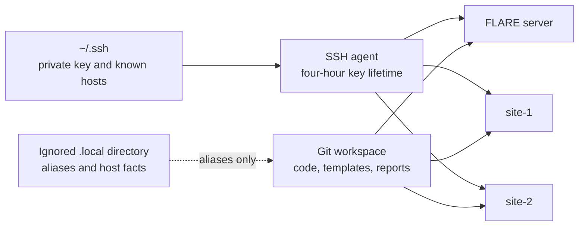

# Short-Lived Machine Access Runbook

Use this workflow for the three-machine FLARE stress cluster. It lets the
workspace orchestrate tests without storing SSH private keys, passwords, cloud
tokens, or NVFlare startup kits in Git.

## Recommended Trust Boundary



The private SSH key and dedicated `known_hosts` file live under `~/.ssh`, outside
the repository. The actual host addresses may live in the ignored
`research/llm_fl_stress/.local/ssh_config`. Ignore rules are only defense in
depth: they do not protect files from local processes, backups, screen sharing,
or accidental copying.

## Information To Request

Ask the machine provider for all of this before the access window starts:

- One unprivileged SSH username and whether your public key can be installed.
- Public or bastion address, SSH port, and SHA256 SSH host-key fingerprint for
  each machine, delivered through a trusted channel.
- Lease start/end time and confirmation that the account/key will be revoked.
- Your allowed source IP range and private server-to-client connectivity.
- Which FLARE ports may be opened privately between the three machines. Do not
  expose FLARE service or admin ports to the public internet.
- Whether `sudo` is available, the intended high-throughput data mount, and who
  is responsible for terminating the machines after testing.

Do not accept `StrictHostKeyChecking=no` as a workaround for missing host-key
fingerprints. `ssh-keyscan` can collect a presented key but cannot prove that it
belongs to the intended machine.

## Create A Time-Boxed SSH Identity

Prefer generating a new key locally and giving the provider only the `.pub`
file. Do not paste a private key or password into chat, a scenario JSON file, an
environment variable, or a shell command.

```bash
install -d -m 700 "${HOME}/.ssh"
ssh-keygen -t ed25519 -a 64 \
  -f "${HOME}/.ssh/flare-stress-access" \
  -C "flare-stress-short-lived"
ssh-add -t 4h "${HOME}/.ssh/flare-stress-access"
ssh-add -l
```

Enter a passphrase when `ssh-keygen` prompts. `ssh-add -t 4h` removes the
identity from the agent after four hours. If the provider instead supplies a
private key, save it directly under `~/.ssh`, run `chmod 600` on it, never copy
it into this workspace, and have the provider revoke it when the lease ends.
The lifetime behavior is defined by the official
[`ssh-add` manual](https://man.openbsd.org/ssh-add).

## Install Only The Public Key

Yes, the public key must be installed for the remote account on each of the
three machines. The private key must never be copied to any resource.

The preferred path is provider-managed installation:

```bash
cat "${HOME}/.ssh/flare-stress-access.pub"
```

Send that single public-key line through the provider's access portal or trusted
channel. Ask the provider to add it to the assigned user's
`~/.ssh/authorized_keys` on the server, `site-1`, and `site-2`, restrict SSH at
the firewall to your source IP, and remove the key when the lease ends. Using
one session-specific key for all three short-lived machines is reasonable; use
separate keys only if the provider requires per-host isolation.

If the machines already allow a temporary password login, verify their host-key
fingerprints first and then use `ssh-copy-id`. This command copies the `.pub`
key, not the private key:

```bash
known_hosts="${HOME}/.ssh/known_hosts_flare_stress"
ssh-copy-id -n \
  -i "${HOME}/.ssh/flare-stress-access.pub" \
  -o StrictHostKeyChecking=yes \
  -o UserKnownHostsFile="${known_hosts}" \
  -p PORT USER@SERVER_ADDRESS
ssh-copy-id \
  -i "${HOME}/.ssh/flare-stress-access.pub" \
  -o StrictHostKeyChecking=yes \
  -o UserKnownHostsFile="${known_hosts}" \
  -p PORT USER@SERVER_ADDRESS
```

The first command is a dry run. Repeat the real command for `site-1` and
`site-2`, entering the temporary password only at the interactive prompt. Do not
put a password in a command, environment variable, file, or Codex message. If
there is no existing password or console access, `ssh-copy-id` cannot bootstrap
the account; the provider must install the public key.

## Configure Local Aliases

Create an ignored connection file from the safe template:

```bash
mkdir -p research/llm_fl_stress/.local
chmod 700 research/llm_fl_stress/.local
cp research/llm_fl_stress/ops/ssh_config.example \
  research/llm_fl_stress/.local/ssh_config
chmod 600 research/llm_fl_stress/.local/ssh_config
```

Replace the three addresses, ports, and username. The template deliberately:

- offers only the configured key with `IdentitiesOnly yes`;
- disables passwords, keyboard-interactive login, agent forwarding, X11, port
  forwarding, and persistent multiplexed sessions;
- requires an already verified host key with `StrictHostKeyChecking yes`; and
- uses a dedicated `~/.ssh/known_hosts_flare_stress` file.

These controls follow the official
[`ssh_config` manual](https://man.openbsd.org/ssh_config), which warns that a
forwarded agent can be used by a compromised remote host and describes strict
host-key checking as the maximum protection against man-in-the-middle attacks.

If a bastion is required, add a verified bastion alias and `ProxyJump` only
after receiving fingerprints for the bastion and each destination.

## Verify Host Keys Before Login

The best option is for the provider to install the expected keys in the
dedicated known-hosts file. Otherwise, collect candidates and compare every
displayed SHA256 fingerprint with the value received through a separate trusted
channel:

```bash
candidate="$(mktemp)"
ssh-keyscan -H SERVER_ADDRESS SITE_1_ADDRESS SITE_2_ADDRESS >"${candidate}"
ssh-keygen -lf "${candidate}"
# Stop unless every fingerprint matches the provider's values.
cat "${candidate}" >>"${HOME}/.ssh/known_hosts_flare_stress"
chmod 600 "${HOME}/.ssh/known_hosts_flare_stress"
rm -f "${candidate}"
```

Add `SITE_3_ADDRESS` to the `ssh-keyscan` command for the three-client run.

Use `ssh-keyscan -p PORT` separately for hosts that do not use port 22. Never
append a candidate merely because it was returned by the target address.

## Validate Access And Capture Machine Facts

Confirm each alias without opening an interactive shell:

```bash
config=research/llm_fl_stress/.local/ssh_config
ssh -F "${config}" flare-server 'printf "connected: "; hostname'
ssh -F "${config}" flare-site-1 'printf "connected: "; hostname'
ssh -F "${config}" flare-site-2 'printf "connected: "; hostname'
# Three-client run only:
ssh -F "${config}" flare-site-3 'printf "connected: "; hostname'
```

Then run the read-only intake collector:

```bash
research/llm_fl_stress/ops/collect-host-facts.sh
```

For the three-client run, include every alias explicitly:

```bash
research/llm_fl_stress/ops/collect-host-facts.sh \
  flare-server flare-site-1 flare-site-2 flare-site-3
```

It stores private host inventory under the ignored `.local/host-facts/`
directory. It captures OS, CPU, RAM, cgroup limits, disks, socket-buffer limits,
Python/PyTorch/NVFlare versions, GPUs, and shell resource limits. It does not
print environment variables or query cloud instance metadata, both of which can
expose credentials.

## NVFlare Credentials Are A Separate Layer

SSH access authenticates machine administration. NVFlare runtime participants
also use provisioned certificates and private keys. Treat every complete startup
kit as secret even if some files inside it, such as a root certificate, are
public.

For NVFlare 2.8, distributed provisioning is the strongest fit when separate
participants should own their credentials: each participant creates and retains
its private key, sends only a certificate request, and verifies the returned
root-CA fingerprint out of band. See the official
[distributed provisioning guide](https://nvflare.readthedocs.io/en/2.8.0/user_guide/nvflare_cli/distributed_provisioning.html).

For a centrally managed short benchmark, keep the provisioning workspace outside
the repository, for example under `${HOME}/.local/share/nvflare-llm-stress/`, and
copy only the server kit to the server and each client kit to its matching
client. Never put a startup kit under `runs/`, because run artifacts are intended
for retention and review.

## Safe Codex Use

This workspace can safely orchestrate the machines after the local SSH setup is
complete:

- Refer to hosts only by `flare-server` and the required `flare-site-N` aliases.
- Keep private keys outside the workspace and loaded into the time-limited agent.
- Do not paste credentials into this task. Codex never needs to read the key.
- Approve networked SSH commands only when their command and destination aliases
  are expected. Commands should not print environment variables, credential
  files, startup-kit contents, or cloud metadata.
- Copy code and non-secret job definitions separately from role-specific startup
  kits. Preserve reports, but redact private addresses and usernames before
  sharing them outside the team.

Codex's local command sandbox requires explicit approval for outbound SSH. Once
the aliases work, it can request that approval and run preflight, installation,
test, and artifact-retrieval commands without being given private key contents.

## End-Of-Lease Checklist

1. Stop FLARE and monitoring processes; copy required reports and logs locally.
2. Confirm no dataset, model credential, startup kit, or private key is included
   in the collected report directory.
3. Remove the SSH identity from the agent with
   `ssh-add -d "${HOME}/.ssh/flare-stress-access"`.
4. Delete the local ephemeral SSH key and temporary NVFlare credential workspace
   after required artifacts are retained.
5. Ask the provider to revoke the public key/account and terminate all three
   machines. Machine termination is the reliable cleanup boundary for ephemeral
   disks; ordinary file deletion on SSD-backed storage is not a secure-erasure
   guarantee.
6. Remove `research/llm_fl_stress/.local/` and review `git status --ignored`
   before staging any project files.
