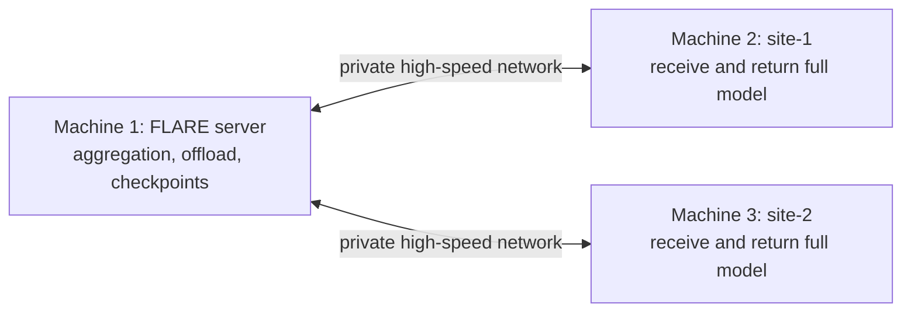

# Machine Decision Guide

Validated against the runs through the completed 2026-07-21 32.5B,
three-client, three-round session. This is the short document to share when
requesting machines or explaining the next test stages. The detailed transfer
diagnosis is in the [large-model bottleneck brief](large-model-transfer-bottleneck-2026-07-20.md).

## One-Minute Summary

- `ENOBUFS` is POSIX error 55, **No buffer space available**. Apple defines it
  as a socket or pipe operation that could not proceed because system buffer
  space was unavailable or a queue was full. It is not the same as process heap
  exhaustion (`ENOMEM`) or disk exhaustion (`ENOSPC`). See the
  [Apple error reference](https://developer.apple.com/library/archive/documentation/System/Conceptual/ManPages_iPhoneOS/man2/intro.2.html).
- In the failed 0.49B run, the error occurred during two simultaneous localhost
  tensor streams. The server then logged communication errors, zero-byte stream
  progress, download timeouts, and lost peers. Because there was no swap or OOM
  evidence, the most likely explanation is local socket/queue pressure. This is
  an inference from the logs, not proof of a specific macOS kernel limit.
- The physical network is not the current throughput limit. Concurrent `iperf3`
  reached about 23.6 Gbps on the 25 Gbps fabric, while NVFlare moved about
  0.75--0.80 Gbps per flow. Larger F3 buffers improved the critical path only 8%.
- The next environment is **exactly three machines**: one FLARE server and two
  clients. A third client is unnecessary for the first transport A/B and should
  be added only after a candidate improvement passes the two-client gate.
- The synthetic server test needs CPU and RAM, not GPUs. Add GPUs only for the
  optional real-model one-step confirmation.
- A 503.49 GiB server and three 125 GiB clients completed 32.5B BF16 for three
  rounds in 1h54m02s. Peak process-tree RSS was 245.46 GiB; the 494.10 GiB cgroup
  gauge was dominated by reclaimable offload/persistence file cache, not one
  unique model copy per client.
- **Recommended next lease:** one 256 GiB server plus two 128 GiB clients for six
  hours, with local NVMe and measured 10/25-Gbps-class private networking. Use it
  for an instrumented 1.5B gRPC+TLS versus TCP+TLS A/B, then 14B and optional
  one-round 32B confirmation only if the candidate improves the critical path.
- Delay 72B until the software path improves at least 30% without correctness,
  retry, or memory regression. When resumed, two clients are sufficient; a
  third client is a separate fan-out experiment, not a 72B prerequisite.

## Exact Topology

Use three separate VMs or physical hosts in the same region and availability
zone. Give them direct private connectivity, synchronized clocks, the same
Python/PyTorch/NVFlare build, and storage that does not share a small root disk.
Run two clients for transport optimization and capacity qualification. Lease a
third client only for the final fan-out regression after the two-client result
is understood.

## Machines To Request

These are measured-data recommendations, not claims that every byte will be
consumed. `Minimum useful` is an intentional boundary test; `preferred` keeps a
meaningful reserve and is the allocation to request for a qualification pass.

| Stage | Nodes | Server RAM, minimum/preferred | Each client RAM | CPU target, server/client | Free fast storage, server/client | Ready/fresh lease | Test |
| --- | ---: | --- | ---: | --- | --- | --- | --- |
| Economy transport-only lane | 3 | 128/128 GiB | 64 GiB | 32/16 | 150/75 GiB | 3/4 h | 1.5B gRPC+TLS/TCP+TLS A/B only |
| **Recommended network-engineering lane** | **3** | **256/256 GiB** | **128 GiB** | **64--96/32** | **500/150 GiB** | **4/6 h** | Instrumented 1.5B A/B, 14B confirmation, optional 32B one round |
| Post-fix three-client regression | 4 | 256/512 GiB | 128 GiB | 64--96/32 | 500/150 GiB | 3/5 h | 1.5B then 32B fan-out confirmation |
| Deferred 32B reclaim boundary | 3 | 512/512 GiB | 128 GiB | 64--96/32 | 500/150 GiB | 5/8 h | Three rounds with absolute `memory.high` at 384, 320, optional 288 GiB |
| Deferred 72B one-round gate | 3 | 768/1,024 GiB | 256 GiB | 96--128/32--64 | 750/200 GiB | 3/4 h | 72.7B BF16, two clients, one round |
| Deferred 72B two-round qualification | 3 | 768/1,024 GiB | 256 GiB | 96--128/32--64 | 1,000/200 GiB | 5/6 h | 72.7B BF16, two clients, two rounds |

The six-hour recommendation includes image/dependency verification, service
redeployment between drivers, repeated microbenchmarks, one failed attempt, and
artifact review. Pure execution needs less time, but a short lease leaves no
room to act on the new counters. Prefer local NVMe; otherwise use provisioned
block storage with guaranteed throughput. Pass `--lease-expiry-utc` so the
harness performs its final recovery checkpoint 15 minutes before teardown.

### Six-Hour Budget

| Lease time | Activity | Exit condition |
| --- | --- | --- |
| 0:00--0:30 | Intake, dependency check, smoke, bidirectional `iperf3` | Hosts and baseline path are recorded |
| 0:30--1:15 | Instrumented 1.5B gRPC+TLS baseline and repeat | Variance and new counters are usable |
| 1:15--2:15 | Redeploy TCP+TLS and repeat exact 1.5B job | Driver A/B decision exists |
| 2:15--3:45 | Implement/redeploy one targeted single-flight or pipeline change | Candidate is testable; no generic buffer sweep |
| 3:45--4:30 | Repeat 1.5B correctness/performance gate | At least 30% gain or documented rejection |
| 4:30--5:15 | 14B one-round confirmation | Improvement and memory safety persist at scale |
| 5:15--6:00 | Optional 32B one round, artifact review, recovery reserve | Local artifacts complete before teardown |

### Current Cloud Examples

On AWS, a matching memory-optimized, network-oriented layout is:

| Stage | Server example | Two client examples |
| --- | --- | --- |
| 32B two rounds | `r8idn.16xlarge` | 2 × `r8idn.4xlarge` |
| 72B one round | `r8idn.24xlarge` | 2 × `r8idn.8xlarge` |
| 72B two rounds | `r8idn.32xlarge` | 2 × `r8idn.8xlarge` |

AWS currently lists R8idn at 128, 256, 512, 768, and 1,024 GiB for the sizes
used here, with local NVMe and increasing network capacity. Confirm regional
availability, quotas, sustained network bandwidth, and storage throughput before
booking. See the official [R8i family specifications](https://aws.amazon.com/ec2/instance-types/r8i/).
Google Cloud memory-optimized families are another option and currently include
VMs into the multi-terabyte range; see the
[Compute Engine memory-optimized guide](https://docs.cloud.google.com/compute/docs/memory-optimized-machines).

## Why Network Speed Matters

`wire/round` is aggregate logical delivery volume, not a count of distinct model
objects resident on the server. FLARE starts one full transfer transaction to
each client and receives one full update transaction from each client, while the
outbound transactions may reference the same global model object/cache. The
table below is the theoretical minimum time to move those bytes through the
server NIC. It excludes serialization, protocol overhead, retries, aggregation,
and checkpointing, so real rounds take longer.

| Tier | Logical wire/round | 10 Gbps minimum | 25 Gbps minimum | 50 Gbps minimum | 100 Gbps minimum |
| --- | ---: | ---: | ---: | ---: | ---: |
| 14.7B | 109.5 GiB | 94.1 s | 37.6 s | 18.8 s | 9.4 s |
| 32.5B | 242.1 GiB | 208.0 s | 83.2 s | 41.6 s | 20.8 s |
| 72.7B | 541.7 GiB | 465.3 s | 186.1 s | 93.1 s | 46.5 s |

The network does not change how much RAM the model requires, but a slow or
bursty network makes timeout and retry behavior dominate the test.

## Measured Scaling And Forecast

The successful BF16 distributed curve now reaches 32.5B. The 10B, 12B, 14.7B,
and 32.5B one-round points fit server process-tree RSS of approximately
`3.034 × payload + 0.86 GiB` and client process-tree RSS of approximately
`1.058 × payload + 2.15 GiB`. The smaller successful two-round points fit
roughly `4.03 × payload + 0.81 GiB` on the server. These are synthetic tensor
data-path fits, not guarantees for optimizer-backed transformer training.

| Tier | BF16 payload | One-round server/client RSS | Sustained server/client RSS | Job time at measured path |
| --- | ---: | ---: | ---: | ---: |
| 14.7B | 27.38 GiB | 83.94/31.17--31.19 GiB measured | 111.08/31.46--31.81 GiB, two rounds measured | 13.1/26.6 min measured |
| 32.5B | 60.54 GiB | 184.51/65.98--66.44 GiB measured | 245.46/about 67 GiB, three clients and three rounds measured | 30.3 min one round; 1h54m02s three rounds |
| 72.7B | 135.41 GiB | 411.7/145.5 GiB fitted | 546.5/145--160 GiB fitted | 65--80/130--165 min expected before transport improvements |

The completed 32B three-round server reached a 494.10 GiB cgroup gauge, but the
highest sampled composition was 224.70 GiB anonymous, 261.57 GiB file cache,
and 7.63 GiB kernel. Process-tree RSS plateaued at 245.46 GiB. This is why the
next memory experiment uses an absolute soft `memory.high` while preserving the
natural `memory.max`: it measures whether Linux can reclaim the page cache rather
than forcing an OOM below already-live usage.

The schema's six-copy server and 2.5-copy client preflight remains intentionally
more conservative than this measured fit. It will flag the recommended 32B and
72B clients and the 72B server even when the measured forecast fits. Keep that
warning as a safety gate and use `--allow-capacity-risk` only for the explicitly
reviewed production commands; do not weaken the global coefficients before the
first 72B artifact exists.

Execution forecasts cover the FLARE job, not image preparation, dependency
installation, review, retries, artifact collection, or teardown. Lease durations
therefore include substantial operational reserve.

## Next Runs, In Order

1. Lease one 256 GiB server and two 128 GiB clients for six hours. Record
   bidirectional single-stream and two-flow `iperf3` before changing FLARE.
2. Run the instrumented 1.5B one-round baseline with gRPC+TLS and the winning
   4 MiB/128 MiB/32 MiB F3 profile. Repeat enough times to establish variance.
3. Redeploy the same federation with direct TCP+TLS and repeat the exact job.
   Compare critical path, effective per-flow throughput, serialization work,
   duplicate production, F3 cache peak, offload writes, and sentinels.
4. If neither driver is 30% faster, use the counters to choose one engineering
   change: per-item single-flight serialization or a bounded producer/consumer
   pipeline. Do not spend the lease sweeping larger generic buffers again.
5. Carry a passing candidate to 14B one round. Use the remaining time for 32B
   one round only if 14B preserves the improvement and memory safety.
6. Add a third client in a later fan-out regression; it is not needed to choose
   the transport fix and is not required for the 72B qualification topology.
7. After the network work, lease a 512 GiB server and two or three 128 GiB clients
   for the 32B three-round reclaim sweep. Set only `memory.high` at 384 then
   320 GiB (optional 288 GiB); do not lower `memory.max`.
8. Resume 72B only after the critical path is at least 30% lower. Start with one
   768 GiB boundary server or one 1 TiB low-risk server and two 256 GiB clients.
   Run one round before booking the two-round qualification.

The distributed 0.49B gate passed, so classify the original local failure as a
same-host macOS transport artifact in that configuration rather than a server
memory limit.

## Optional Real-Model Confirmation

Do not rent GPUs for the synthetic capacity curve. For the later selected-layer
or LoRA one-step confirmation, a reasonable starting point per client is:

| Tier | GPU starting point per client | Host RAM per client |
| --- | --- | ---: |
| 14B | 1 × H100 80 GB or H200 141 GB | 128 GiB |
| 32B | 2 × H100 80 GB or 1 × H200 141 GB | 256 GiB |
| 72B | 4 × H100 80 GB or 2 × H200 141 GB | 512 GiB |

These GPU counts assume a tiny batch and selected-layer or adapter update, not
full-model optimizer-state training. Full fine-tuning needs a separate sharding
and optimizer-memory plan. NVIDIA lists H100 SXM with 80 GB and H200 with
141 GB of GPU memory in the official [H100](https://www.nvidia.com/en-us/data-center/h100/)
and [H200](https://www.nvidia.com/en-sg/data-center/h200/) specifications.
