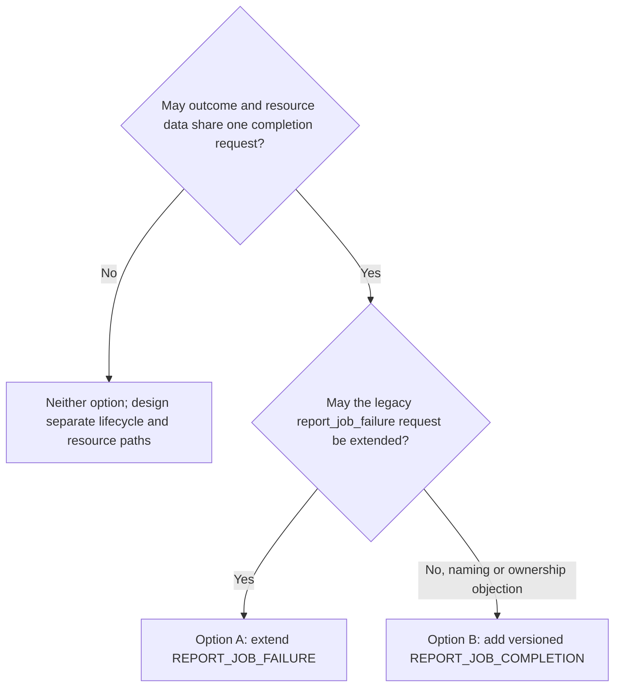

# Phase 1 resource statistics: review guide

This is the best place to start a design review. It explains the proposal in
plain language and points to the detailed contract only when needed.

## Suggested meeting path

1. Agree on what the feature does and does not measure.
2. Review the one-final-report decision and its tradeoffs.
3. Walk through collection, delivery, server rollup, and workspace storage.
4. Review the one-job CLI.
5. Review the new study-rollup CLI.
6. Confirm the bounded remaining implementation gaps.

The detailed implementation plan can be used to answer field, hook, or failure
questions without reading it linearly during the meeting.

For steps 3 through 5, use the
[real PyTorch Colossus run](colossus_pytorch_e2e_reference/README.md). It puts
the exact archived records beside the job/site/study CLI and external GPU
evidence. Its archived report demonstrates the earlier honest partial result:
PyTorch used the L40, but the collector then could not resolve the CUDA Runtime
outside the system loader path, so the report contains no GPU total. The
current implementation closes that specific discovery gap through installed
NVIDIA distribution metadata while leaving the historical artifact unchanged.

## The idea in one paragraph

Each NVFlare client and server job process keeps CPU, memory, and GPU
capacity-time in memory while it runs. At finalization it writes one bounded
private handoff containing those totals, one workspace-filesystem capacity
observation, and typed retained-result/F3 results. Retained-result ownership is
not yet bound for every workflow, so that value remains unavailable rather
than guessed. F3 now has platform-owned counters for deployment, real task
responses, and task results. The parent validates the handoff, merges its own
F3 contribution with the child's, and builds the participant's only public
report. The client parent sends that report once on the existing
terminal-outcome request; a newly named versioned completion request remains a
fallback design, not implemented code. The server adds accepted participant
totals, stores everything in the normal archived job workspace, and serves
either one job or all retained jobs in a study through the CLI.

## What changed after review

The earlier design exposed start records, final records, measurement attempts,
attempt IDs, environment keys, end reasons, stability checks, and raw periods.
Those objects existed mainly so the server could join records and repeat the
capacity-time calculation.

The selected design removes them. A participant now persists and transmits
exactly one final `participant_summary`.

This produces a much smaller contract:

```text
participant_summary
├── identity and schema version
├── one resource_time result
├── one final workspace-filesystem capacity observation
├── retained_content
└── F3 counters
```

CPU, memory, and GPU share one `resource_time.status`. Separate measurement
status fields are not repeated under every resource.

## What the feature measures

It measures capacity-time visible inside the NVFlare job environment:

- CPU unit-seconds;
- memory byte-seconds;
- GPU instance-seconds, grouped by device kind and model;
- selected job-scoped F3 bytes; and
- bytes in an authoritative retained-result set.

It also records one point-in-time capacity value for the filesystem containing
the job workspace. That last value is shown only as a site observation and is
never added across participants or jobs.

It does not measure actual utilization, scheduler reservations, physical
machine capacity, energy, cost, or billing. A job reports what its process can
see with ordinary-user APIs.

## How the calculation works

### Implemented Phase 1 behavior in today's process model

Near job-process startup, NVFlare probes CPU, memory, and GPU capacity and
start an in-memory monotonic-time accumulator. Today's code does not announce
resource changes during the process, so this first adapter assumes the initial
capacity remains until `_archive_results()`.

Official Process, Docker, Kubernetes, and Slurm launchers run the NVFlare
worker through a fixed NVFlare bootstrap with Python `-I` and a literal
`client` or `server` selector. The Process launcher uses the absolute platform
bootstrap script; Docker, Kubernetes, and Slurm use its installed module. A
historical executable-module value is exact-allowlisted only to choose one of
those selectors and is never copied into the command. The worker takes the
snapshot before workspace download and before enabling app/site custom paths.
This happens automatically and requires no new privilege or user
configuration.

For the current private interval:

```text
CPU unit-seconds     = visible CPU units × elapsed seconds
memory byte-seconds  = visible memory bytes × elapsed seconds
GPU instance-seconds = visible GPU instances × elapsed seconds
```

Nothing is persisted or sent at startup.

Phase 1 keeps the resulting products and `measured_seconds`; it does not keep
the original CPU-unit, memory-byte, or GPU-count observations. Dividing a
complete participant's totals by its duration gives a time-weighted average,
but not the sequence of capacity changes. Hardware labels remain, and the
workspace-filesystem capacity is a separate final point observation. A future
Phase 2 contract may add a bounded periodic capacity history.

This interval includes idle waits inside the job process. It is visible
process capacity-time, not active-task time or utilization. Adding participant
`measured_seconds` can therefore produce a value larger than job wall time.

### Future resource changes

The current adapter assumes one client or server job process stays alive for
that participant. If resources change inside that process, a platform-only
capacity-change call first adds the old capacity through the change time, then
starts using the new capacity.

That adapter is not a requirement on the upcoming execution design. If a
future design replaces workers or runs tasks in another process, the component
that spans the participant's logical work must own or carry forward the
accumulated totals and produce the one terminal report. The public report,
server reduction, and CLI do not change; the design deliberately does not
choose that future owner or handoff mechanism.

A single end snapshot must never be multiplied by the full duration. That
would overcount or undercount any resource that changed during the job.

## Why the simpler design is reasonable

Benefits:

- one report per participant;
- fewer fields and status codes;
- no fragment correlation or period reconciliation;
- no public attempt identity or environment identity;
- smaller participant files and simpler CLI details; and
- the same job and study rollups regardless of how future tasks are run.

Tradeoffs:

- loss of the participant parent or its connection before delivery leaves no
  participant report;
- loss of only the job child still yields a parent-built report, but its
  child-derived measurements are unavailable and F3 can be partial;
- the server can validate final totals and bounds but cannot recompute them
  without raw periods;
- current code assumes the initially visible capacity remains until finish;
  and
- future dynamic allocation is accurate only when an owner spanning the
  relevant work reports every change and preserves the accumulated totals.

The report should therefore be described as an authenticated participant
self-report, not tamper-proof or independently reconstructed evidence.

## What one final report contains

`resource_time` contains:

- one overall `reported`, `partial`, or `unavailable` status;
- measured seconds;
- CPU unit-second groups, including CPU evidence/model information;
- one memory byte-seconds value; and
- GPU instance-second groups, including model information.

An optional short issue list explains partial or unavailable results. MIG
groups are omitted when MIG does not apply.

The remaining top-level facts are:

- the final observed capacity of the workspace filesystem;
- retained-content status and bytes; and
- F3 status and sender counters.

There are no model filenames or `model.pt` hash fields. NVFlare does not assume
which files are models.

## How values are observed

The concise source, hook, and readiness table is in the
[operational collection map](ROLLUP_FLOW.md#operational-collection-map).
Production collection uses native APIs and direct kernel-interface parsing;
the shell commands in the implementation plan are operator diagnostics only.
CPU, memory, CUDA/NVML, workspace-filesystem, and F3 collection are implemented
in the production path. The current focused and socket-backed F3 suites pass;
a new live process-mode reference remains. Authoritative retained-result sets
remain open and report unavailable until implemented.

### CPU

Use the tightest applicable limit visible to the process:

- process affinity;
- effective cgroup cpuset, including ancestor constraints;
- effective cgroup CPU quota, including ancestor constraints; and
- online logical processors as fallback.

`online_count` is diagnostic evidence. It is not added to another CPU count.
Quota can produce a fractional CPU value and is not rounded up. CPU architecture
and model are included where they can be determined without raw host IDs.

If an applicable cgroup cpuset or quota is unreadable or malformed, CPU is
unavailable. The implementation does not fall back to a wider affinity or
online count that could overstate capacity.

### Memory

Use the lower of process-visible physical memory and the tightest finite
cgroup memory limit. Do not add swap. This is visible capacity, not resident
set size or actual memory touched.

If an applicable cgroup memory limit is unreadable or malformed, memory is
unavailable rather than falling back to the larger physical-memory value.

### GPU

A numeric count requires successful CUDA Runtime enumeration. A raw
`CUDA_VISIBLE_DEVICES` value and `nvidia-smi` are diagnostics only. NVML may
enrich CUDA-validated devices with model information but cannot create a count
by itself.

The collector first uses normal dynamic-loader lookup. If loading or Runtime
enumeration fails, it may load one CUDA Runtime owned by an allowlisted
installed NVIDIA runtime distribution. Discovery is restricted to Python roots
frozen before app/site custom paths are enabled; the target must be a contained
regular file and distinct candidates are rejected as ambiguous. The target is
loaded by absolute path with local, immediate symbol resolution, after which
the same Runtime count, Driver UUID, and NVML matching rules apply. This does
not import Torch, change the environment, run a subprocess, add a setting, or
persist a library path or hash.

This initial adapter intentionally does not accept a runtime owned directly by
a legacy `torch` distribution or a conda-only layout. Those cases remain
partial or unavailable until their metadata and loading behavior have a
separately validated adapter.

Full GPUs and MIG instances are separate groups. MIG fields and CLI columns
are absent when they do not apply.

The current in-process adapter observes only the node running the NVFlare
worker. For a Slurm job spanning more than one node, production discards the
rank-zero numeric resource-time totals and emits
`resource_time: {status: unavailable, issues: [unsupported]}`. Platform-owned
collection must cover every participating node before those jobs report
resource time.

### Workspace filesystem

At finalization, call `statvfs()` on the filesystem containing the existing
NVFlare job workspace. Record `f_blocks × f_frsize` once.

Do not enumerate other mounts, compute storage-time, or total this value. It
is visible workspace-filesystem capacity, not job storage usage or allocation.

### Saved results

Count only a bounded result set that NVFlare already identifies as retained.
Do not scan the whole workspace or guess model filenames. If no authoritative
result set exists for a workflow, saved-result bytes are unavailable. The
required owner/provider boundary and failure behavior are detailed in
[Remaining implementation gaps](GAPS.md#2-retained-result-bytes).

### F3

F3 publishes one `remote_accepted` counter pair. It includes exactly three
platform-classified operations: job application deployment, a response that
contains a real task, and a submitted task result. It does not include task
poll requests, acknowledgements, final in-process delivery, failed sends, an
extra relay contribution, workspace transfer, the resource report,
authentication, heartbeats, logs, HCI, or unclassified traffic.

One message means one top-level logical send to one destination. Its bytes are
measured after FOBS encoding and before optional encryption. If FOBS moves a
large object through `DownloadService`, successfully accepted unique object
bytes are added to the same operation without another message. Retries do not
add bytes again.

Only the trusted semantic origin counts. The accounting context stays inside
the originating process and is not serialized, so a relay cannot count the
operation a second time. A remote logical destination routed through a local
first-hop relay is still counted once by the origin; it is not mistaken for a
final local delivery.

For a real task response, the server-job callback knows both endpoints before
it returns the response to CellNet. It pre-admits that pair so cleanup cannot
freeze in the short gap between callback return and transport startup. This
does not count bytes early: FOBS sizing and the transport success/failure
outcome are still supplied later by the normal send path.

During child cleanup, NVFlare first closes command admission and gives already
admitted command callbacks up to five seconds to finish while Cell and
streaming remain alive. Timeout or error marks `counter_gap`. The child then
closes and drains its F3 admissions for up to five seconds, freezes its local
counter into the private handoff, and only then stops streaming and Cell. Both
condition waits return immediately when nothing is active or pending. Their
actual elapsed tails precede the current resource-time final reading. If the
callback pre-drain failed, cleanup keeps one bounded post-stop callback wait;
that last wait occurs after publication and does not enter resource time.

After the child ends, the parent stops new F3 admissions, freezes immediately,
and performs a checked merge. CP originates no included class and SP's blocking
deployment sends have already completed; an unexpected pending parent operation
becomes `partial/counter_gap` without delaying terminal publication. A child
send contributes only if its acceptance boundary settles before the cutoff. In
particular, a streamed send remains pending until its
`StreamFuture` ends successfully; asynchronous failure or cancellation
abandons it. If a drain cannot complete, useful numeric data is retained as
`partial/counter_gap`. Restored history is
`partial/attribution_incomplete`. The parent freezes before constructing the
terminal report, so the report cannot count itself.

The production hooks are present, and the current focused and socket-backed
suites pass. A new process-mode
or Colossus live F3 reference has not yet replaced the older `not_bound`
artifact. See [F3 implementation status](F3_GAP.md).

## How completion and the report reach the server

Today, after `job_handle.wait()`, the client parent already sends a terminal
outcome to the root server over authenticated CellNet:

```text
target  = ROOT_SERVER
channel = task
topic   = report_job_failure
handler = FedServer.process_job_failure()
```

Despite its historical name, this message is sent for successful exits too.
The parent first builds the sole canonical `participant_summary` from the
validated private handoff, deletes staging, and frees launcher-managed compute
resources. It then sends the request and waits for the CellNet reply, so that
network wait does not keep the completed job's allocation held. Parent F3 is
already frozen before this request. The branch implements the first of two
reviewed one-message transports:

- **Option A, implemented:** extend `CellChannelTopic.REPORT_JOB_FAILURE`, wire
  topic `report_job_failure`, with the exact report bytes. The server compares
  validated canonical bytes directly for duplicate/conflict decisions.
- **Option B, unimplemented fallback:** replace that request with
  `CellChannelTopic.REPORT_JOB_COMPLETION`, wire topic
  `report_job_completion`, containing exact integer `protocol_version: 1` and
  the same job outcome and report bytes.

Option B would be one combined completion request, not a second resource-report
message. If adopted, a client/job would choose exactly one option before
sending and would never dual send. Current production always uses Option A,
makes one application-level send, and has no retry loop or receipt tombstone.
Any future capability and rollout selection must add no operator, job, or
launcher setting.

Why both options keep one message:

- the child has finished, so its private measurements are stable;
- the parent can include parent-process F3 traffic before final serialization;
- the parent still has its authenticated connection;
- completion and report share one cutoff and acceptance result; and
- it avoids a second message, acknowledgement, and cutoff race.

A federated event is best effort. Model or task metadata is not universal.
Server pull requires job cells to remain alive. A separate resource-only
CellNet request would create another completion protocol. These alternatives
remain useful for other purposes but are not either one-message path.

Option B addresses only an objection to the stale failure-oriented name or to
adding resource ownership to `process_job_failure()`. It has the same
completion-path validation, direct byte comparison, bounded in-memory ledger
insertion, acknowledgement, and potential retry cost as Option A;
participant-file writes still happen later at finalization. If reviewers
require lifecycle control and resource data to be separate, neither option is
sufficient; that requires a different two-path design.



## How the server handles it

The server:

1. binds the message to the authenticated expected client and requires its
   `participant_name` to match that trusted identity;
2. checks size, parses strict JSON, and validates the schema and semantic
   bounds;
3. accepts the terminal resource-time totals as an authenticated self-report;
4. compares canonical bytes directly under the per-job lock;
5. keeps the first valid canonical bytes in a bounded in-memory per-job ledger;
6. treats a byte-for-byte retry as a duplicate and different valid bytes as a
   conflict;
7. closes acceptance at the selected completion-request cutoff;
8. adds accepted totals, then writes and fsyncs accepted participant files; and
9. writes and fsyncs `resource_summary.json` last in the parent-owned local
   construction directory as the publication marker.

The server acknowledges `accepted` after live-ledger insertion, before any
participant file is written. Each report is capped at 1 MiB and the accepted
canonical bytes held for one job are capped at 64 MiB. The acknowledgement is
therefore not restart-durable.

The server persists the originally selected client names in
`JobMetaKey.RESOURCE_PARTICIPANTS`, so a root-parent restart can rebuild the
expected denominator. It does not restore reports already accepted before the
restart. Restore starts an empty accepted ledger and clears stale in-progress
resource files; with the current one-send client, those pre-restart reports
normally become `missing`.

A server job process restored from a snapshot starts a new collector. It keeps
the numeric post-restore interval but marks resource time
`partial/observation_incomplete`, so it does not claim to cover the earlier
interval.

On normal completion, the server uses the existing client-outcome wait as the
single report window. If the server job process fails, it skips that grace
period and closes acceptance immediately after its bounded local assembly;
later client reports cannot change the rollup.

The server cannot recompute capacity-time because raw private intervals are not
in the final report. It can still reject invalid structure, units, numbers,
bounds, participant-name binding, grouping, or non-canonical bytes.

A resource-report failure never changes the federated job's success, failure,
or abort result.

## Where the files live

During finalization, the server run workspace contains:

```text
resource_stats/participants/<participant_name>.json
resource_stats/resource_summary.json
```

Normal job archival stores this directory in the existing `WORKSPACE`
component. That is the only retained copy. The existing archiver may write ZIP
members in any order; the reader does not interpret archive entry order.

Normal workspace packaging can flatten run, result, log, and audit roots, and
that packaging remains unchanged. The resource reader treats the summary as
the publication marker, derives the exact accepted participant filenames from
it, and requires that exact `resource_stats/` namespace. Without the summary,
orphan participant files are an unpublished incomplete bundle. The reader
always validates the summary schema. When `--site` requests a participant
detail record, it also validates that selected record's schema and job/name
identity and reconciles its copied values with the summary. Duplicate, staging,
missing, or extra members make the resource view unavailable rather than
allowing an ambiguous file to be selected.

There is no `RESOURCE_STATS` component, summary database row, study-summary
file, or generic component-prefix API. The CLI asks the server to safely read
fixed members from the existing workspace archive.

## One-job CLI

```bash
nvflare job resources --job JOB_ID
nvflare job resources --job JOB_ID --study STUDY_NAME
nvflare job resources --job JOB_ID --study STUDY_NAME --site SITE_NAME
nvflare job resources --job JOB_ID --study STUDY_NAME --format json
```

`--job` alone selects the job from the `default` study. Combining `--job` and
`--study` selects one job from the named study.

There is no automatic cross-study job search. NVFlare binds job visibility to
the authenticated session's study, so a job in another study intentionally
appears not found, matching the other job commands.

The default view shows the job rollup and participant coverage. `--site` adds
one participant's final report details. JSON uses base units; text may show
CPU-hours, GiB-hours, GPU-hours, GiB, and F3 byte units.

The authenticated `GET_JOB_RESOURCES` server handler applies normal job/study
authorization, stages the existing `WORKSPACE`, validates the published
resource bundle, and returns validated JSON. The remote CLI does not receive an arbitrary server
path. The server stages the archive as a temporary file and reads only bounded
fixed members; it does not load the full workspace archive into Python memory.

Generated examples:

- [job text output](schema/golden/v1/finalized_job/cli/resources-all.txt)
- [one-participant detail](schema/golden/v1/finalized_job/cli/resources-site-1-details.txt)
- [job JSON output](schema/golden/v1/finalized_job/cli/resources-all.json)

## Study CLI

```bash
nvflare job resources --study STUDY_NAME
nvflare job resources --study STUDY_NAME --format json
```

`--study` without `--job` selects all retained jobs in that study. The bare
`nvflare job resources` command shows help, and `--site` requires `--job`.

The authenticated `GET_STUDY_RESOURCES` handler uses current active-study
authorization and makes one pass over retained jobs visible to the caller. It
materializes the IDs and statuses from that pass and does not reclassify them
while reading archives. It stages, reads, and removes one terminal job's
`WORKSPACE` at a time, so it never holds every study archive or full archive
byte strings in memory.

The server gets study membership from its existing job metadata, not from a
resource report.

For that fixed list:

- nonterminal jobs are excluded and counted;
- terminal jobs with valid resource summaries are included;
- terminal jobs with absent or invalid summaries are marked unavailable; and
- valid jobs contribute measured time, CPU, memory, GPU, retained-content, and
  F3 remote-accepted totals.

For this contract, terminal uses the existing job-CLI predicate: a status
beginning `FINISHED:`, or the retained legacy values `FINISHED_OK`,
`FINISHED_EXCEPTION`, `ABORTED`, `ABANDONED`, and `FAILED`. The row keeps the
exact bounded status string read during the scan.

Workspace-filesystem capacity is never aggregated.

The response shows per-job status and included/unavailable/excluded counts, so
users can judge coverage. The view is calculated on demand from retained
archives. It is not a billing ledger and cannot include deleted jobs.

The handler rejects more than 10,000 retained jobs. It also charges every
prospective canonical job row against a cumulative 64 MiB budget before
appending it, then checks the complete serialized result against the same
limit. Either failure returns no partial rows or subtotal.

Generated examples:

- [study text output](schema/golden/v1/finalized_job/cli/resources-study.txt)
- [study JSON output](schema/golden/v1/finalized_job/cli/resources-study.json)
- [canonical study response](schema/golden/v1/study_summary.json)

## Failure cases worth discussing

| Situation | Result |
| --- | --- |
| Normal job end | One final report is produced and delivered. |
| Application exception reaches finalization | Report is still attempted; job failure remains separate. |
| Child process exits without a valid handoff | Parent sends one report with child-derived fields unavailable and any usable parent F3 marked partial. |
| Parent/site/connection is lost before delivery | No accepted report; participant is missing. |
| Initial probe is partly unavailable | One final report may have partial resource time. |
| Applicable cgroup CPU or memory data is unreadable or malformed | That dimension fails closed instead of falling back to a wider value. |
| Server job process is restored | The new interval is numeric where possible but marked `partial/observation_incomplete`. |
| Server parent F3 history is restored | Keep the new subtotal and mark F3 `partial/attribution_incomplete`. |
| An admitted F3 operation does not settle before the fixed cutoff | Keep the bounded subtotal as `partial/counter_gap`; do not delay finalization indefinitely. |
| An F3 route loses trusted attribution or large-object completion evidence | Report partial or unavailable F3; do not substitute generic CellNet totals. |
| Completion request is lost | Client does not retry; the participant can be missing. |
| Completion reply is lost | Server may already have accepted the report, but the client does not retry or learn that status. |
| Root parent restarts after accepting a report | Expected names are restored, but accepted reports are not; a pre-restart report normally becomes missing. |
| Invalid report | Server rejects it and does not use the values. |
| Different valid replay | First report remains; replay is a conflict. |
| Report after cutoff | It is too late and cannot rewrite the archive. |
| Server job process fails | Skip the normal client-outcome wait and close acceptance immediately after local assembly. |
| Workspace archival fails | Job resource view is unavailable; study view marks the terminal job unavailable. |
| A flattened workspace has a duplicate, missing, staging, or extra `resource_stats/` member | Archive verification fails closed; the job resource view is unavailable. |
| Generated job summary exceeds 64 MiB | Discard the incomplete resource bundle; job outcome is unchanged and its resource view is unavailable. |
| Generated study response exceeds 64 MiB | Return `RESOURCE_VIEW_TOO_LARGE`; never return a truncated subtotal. |
| Job is running when the study scan records its status | It is excluded, not partially counted. |
| Job was deleted | It is not in the retained-job view and cannot be recovered. |

## Trust and privacy

- Either transport reuses existing Cell sender checks. Secure mode verifies the
  signed token and origin before the handler; insecure mode relies on the
  current registered-client token. This feature adds no stronger identity or
  hardware-attestation claim.
- The server binds the existing participant name and role from trusted
  expected state. A name inside the report never authenticates itself.
- No resource-specific pseudonym, attempt ID, or environment key exists in the
  public contract.
- The registered participant name is used directly. Duplicate/conflict
  decisions compare exact canonical bytes; that comparison makes no signing or
  cryptographic integrity claim.
- CPU/GPU model is retained because it materially changes interpretation.
- Raw GPU UUIDs, serial numbers, bus addresses, hostnames, usernames, paths,
  and arbitrary environment variables are excluded.
- Official Process, Docker, Kubernetes, and Slurm workers use the fixed
  bootstrap and selector with isolated Python, then snapshot before
  custom-path activation.
  A bring-your-own-container entrypoint or globally installed `sitecustomize`
  can still run earlier, and later same-process job code can affect evidence or
  alter the private handoff. This is a self-report, not hardware attestation.
- The ZIP reader checks the CRC of each member it reads, which can detect
  accidental corruption of that member. This is not a cryptographic integrity
  check, signature, or protection against an administrator with storage
  access. The reader's schema, identity, value-reconciliation, and
  exact-namespace checks establish internal consistency only.

## Questions already decided

- One final participant report: yes.
- Public start/end or attempt records: no.
- One compute measurement status: yes.
- CPU and GPU models: yes, without stable device identity.
- MIG inapplicable fields: omit them.
- Completion and resource report share exactly one authenticated request: yes.
- Completion topic: the implementation extends `REPORT_JOB_FAILURE` (Option
  A); versioned `REPORT_JOB_COMPLETION` is an unimplemented fallback. Never
  dual send.
- Option B changes naming and handler ownership, not critical-path cost.
- Separate lifecycle and resource-delivery paths: no; neither one-message
  option provides that separation.
- Event or model metadata as the durable transport: no.
- Separate resource job-store component: no.
- Resource-specific checksums or a separate archive index: no. Live retries
  compare canonical bytes directly; archived inventory comes from the final
  summary.
- Job and study query source: existing archived `WORKSPACE`.
- Storage byte-seconds or workspace-capacity totals: no.
- Study view: on demand over retained terminal jobs, with visible coverage.
- Official launcher bootstrap: a fixed NVFlare bootstrap and selector, Python
  `-I`, and snapshot before workspace download/custom activation, with no user
  setting.
- New privileges or deployment configuration: no.
- F3 public value: remote accepted only.
- F3 classes: job application, real task response, and task result only.
- F3 byte boundary: after FOBS encoding and before optional encryption.
- F3 ownership: trusted semantic origin only; a local first-hop relay does not
  suppress the origin's remote send or recount it.
- Large FOBS values: fold unique accepted `DownloadService` bytes into the
  originating operation without another message.

## Remaining implementation work

- broader platform/version and packaging validation for the implemented CUDA
  Runtime discovery and CUDA/NVML model matching, including device subsets,
  multi-GPU, MIG, legacy `torch`-owned runtimes, and conda-only layouts;
- a new process-mode F3 run to replace the historical `not_bound` live
  artifact; the current focused and socket-backed suites already pass;
- authoritative retained-result sets for supported workflows;
- root-parent restart recovery for accepted report bytes, invalid history,
  and cutoff state if required (expected names are already restored);
- supported OS/container/scheduler matrix;
- a decision on whether to keep implemented Option A or implement Option B,
  including mixed-version capability/rollout behavior without a new operator
  setting; and
- the fixed 10,000-job study bound and remote-store performance.

Unimplemented paths must report partial or unavailable data. They must not
guess from environment strings, logs, filenames, generic network pools, or an
end-of-job capacity snapshot.

## File map

| File | Purpose |
| --- | --- |
| [Implementation plan](../../docs/design/job_resource_statistics_implementation_plan.md) | Full selected contract, collection rules, transport, CLI, tests, and code map. |
| [Current-code integration](CURRENT_CODE_INTEGRATION.md) | Exact process hooks, CellNet envelope, acceptance, cutoff, archive, and query mechanics. |
| [Rollup flow](ROLLUP_FLOW.md) | Participant-to-job-to-study data flow and arithmetic. |
| [Schema README](schema/README.md) | Artifact layout and validation entry points. |
| [Field catalog](schema/FIELD_CATALOG.md) | Exact fields, types, bounds, nullability, and privacy rules. |
| [Code catalog](schema/CODE_CATALOG.md) | Status and issue allowlists. |
| [Golden artifacts](schema/golden/v1) | Reconciled JSON, archive, and CLI examples. |
| [Remaining gaps](GAPS.md) | Implementation questions and safe fallback behavior. |
| [Phase 2 sketch](../../docs/design/job_resource_statistics_phase2_telemetry_sketch.md) | Optional post-finalization publication using `JobStatsReporter`. |
