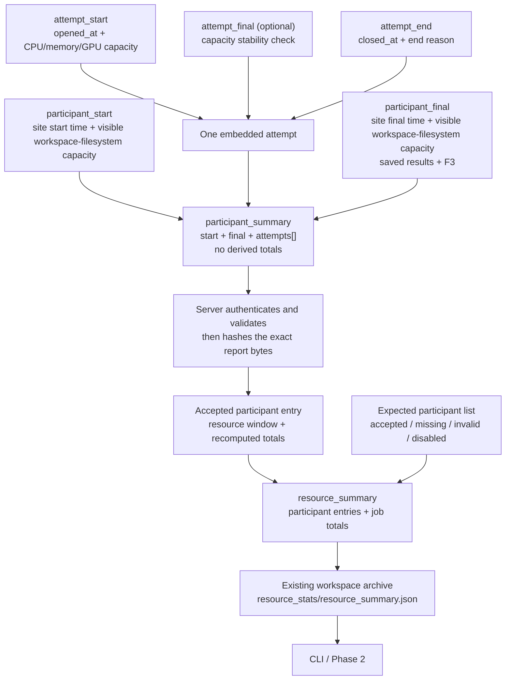

# From observations to the final job summary

This document shows how one site's resource observations become a final job
result. It also explains the two different start/final pairs and how the CLI
reads that result from the job's existing archived workspace.

## The complete flow



An attempt does not become a site report by itself. At site completion, NVFlare
combines the site-level start and final facts with zero or more measurement
periods into one `participant_summary`.

## Two different start/final pairs

| Records | Scope | How they are used |
| --- | --- | --- |
| `participant_start` and `participant_final` | The site's whole participation in the job | Bound the site lifecycle and retain the two visible workspace-filesystem capacity observations. `participant_final` also contains saved-result bytes and F3 counters. |
| `attempt_start`, optional `attempt_final`, and `attempt_end` | One CPU, memory, and GPU measurement period | Start supplies capacity, end supplies duration, and optional final checks whether the starting capacity remained stable. |

The participant timestamps do not define compute time. They ensure that every
measurement period falls inside the site's lifecycle. The visible
workspace-filesystem capacity observations remain point-in-time facts; they
are not multiplied or summed.

## Stage 1: assemble one site report

The small start, final, and end records are logical fragments. They may be held
in memory or existing NVFlare state and never exist as separate files.

The site assembles them as follows:

| Logical fragment | Location in `participant_summary` |
| --- | --- |
| `participant_start.observed_at` and `.storage` | `start` |
| `attempt_start.opened_at` and `.capacity` | one `attempts[]` entry's `opened_at` and `start` |
| optional `attempt_final.capacity` | the same entry's optional `final` |
| `attempt_end.closed_at` and `.reason` | the same entry's `end` |
| `participant_final.observed_at`, `.storage`, `.retained_content`, and `.f3` | `final` |

The attempt fragments are correlated by their job, participant, attempt ID, and
measurement-scope key. Repeated identity fields are omitted inside the embedded
attempt. Attempts must have unique IDs, fit inside the participant lifecycle,
and not overlap when they use the same measurement-scope key.

The resulting record has this shape:

```text
participant_summary
├── participant_key
├── start
│   ├── observed_at
│   └── storage.capacity_bytes
├── attempts[]
│   ├── attempt_id
│   ├── environment_key
│   ├── opened_at
│   ├── start.capacity
│   ├── optional final.capacity
│   └── end
└── final
    ├── observed_at
    ├── storage.capacity_bytes
    ├── retained_content
    └── f3
```

`participant_summary` is the detailed site report. It intentionally contains
no derived totals.

The standalone `participant_id` and role are not repeated in this report. The
job-scoped `participant_key` identifies it. When the server accepts the report,
trusted expected-participant state supplies the display ID and role.

## Stage 2: derive one participant's totals

The server validates the complete `participant_summary` before using it. It
then derives every participant total rather than trusting totals supplied by
the site.

For each measurement period:

```text
duration = end.closed_at - opened_at

CPU time    = start CPU units × duration
memory time = start memory bytes × duration
GPU time    = start GPU count × duration
```

The optional attempt final is stability evidence only. It is not averaged with
the start, does not replace the start, and does not define duration. A missing,
unavailable, or numerically different final makes that resource's derived
total partial, but the valid start-based contribution remains.

The server sums all measurement periods and records:

- `resource_window_seconds`, the sum of their durations;
- CPU unit-seconds, grouped by CPU model and architecture;
- memory byte-seconds;
- GPU instance-seconds, grouped by GPU kind and optional hardware metadata;
- `participant_final.retained_content.bytes`, once; and
- `participant_final.f3.remote_accepted`, once.

The other F3 counters remain in the archived site report. The two visible
workspace-filesystem capacity observations also remain there and do not enter
participant totals.

For each total, the derived status is:

- `reported` when numeric evidence is complete;
- `partial` when a numeric contribution exists but some evidence is
  incomplete; or
- `unavailable` when no numeric contribution exists.

The accepted participant entry in `resource_summary` contains the trusted
display identity, receipt time, exact report digest, resource window, and
recomputed totals:

```json
{
  "participant_id": "site-1",
  "participant_key": "sha256-...",
  "role": "client",
  "status": "accepted",
  "received_at": "2026-09-09T14:37:03.1Z",
  "summary_sha256": "...",
  "resource_window_seconds": "2223",
  "totals": {
    "cpu": {},
    "memory": {},
    "gpu": {},
    "retained_content": {},
    "f3": {}
  }
}
```

`summary_sha256` is the SHA-256 digest of the exact accepted
`participant_summary` bytes. The compact entry does not duplicate the raw
start, final, or attempt records.

## Stage 3: derive the job result

The server starts with the independently known list of every client and server
expected for the job. At the fixed report cutoff, it classifies each one as
`accepted`, `missing`, `invalid`, or `disabled`.

Only accepted numeric participant totals contribute to job totals. CPU and GPU
values preserve their hardware groups; memory, saved-result bytes, and accepted
remote F3 counters are summed directly.

A job total is:

- `reported` only when every expected participant is accepted and every
  accepted contribution for that total is reported;
- `partial` when at least one numeric contribution exists but report coverage
  or measurement evidence is incomplete; or
- `unavailable` when no numeric contribution exists.

The server validates that the stored job totals exactly equal this deterministic
result. Raw attempts and visible workspace-filesystem capacity observations
remain in the archived participant reports rather than being copied into
`resource_summary`.

## Worked partial example

The generated `site-2` report has two measured periods:

```text
Period 1:   300 seconds × 16 CPU units × 128 GiB memory × 2 GPUs
Gap:        300 seconds, not measured and not counted
Period 2: 1,623 seconds × 32 CPU units × 192 GiB memory × 4 GPUs
```

The participant rollup is:

```text
Resource window = 300 + 1,623 = 1,923 seconds
CPU total       = 16×300 + 32×1,623 = 56,736 unit-seconds
GPU total       = 2×300 + 4×1,623   = 7,092 instance-seconds
Memory total    = 375,826,818,269,184 byte-seconds
```

The first period has no final stability observation. The numeric contributions
remain, but the CPU, memory, and GPU totals are partial. Saved-result data is
unavailable for this participant, while its F3 remote-accepted counter is added
once.

See the complete [site-2 report](schema/golden/v1/participant_summary_partial_periods.json)
and its compact entry in the [job summary](schema/golden/v1/resource_summary.json).

## How the CLI reads the result

There is one stored copy. Before the server run is archived, the finalized
workspace contains:

```text
resource_stats/
├── resource_summary.json
├── manifest.json
└── participants/
    └── <participant_key>.json
```

Current NVFlare already saves the completed run directory as the job's
`workspace` component. In filesystem storage, that component is a ZIP file.
The proposed command reuses that archive instead of creating a second job-store
component.

The CLI is remote, so it does not open the server's filesystem itself. Its
authenticated server handler follows this sequence:

1. Require the job to have reached a terminal state.
2. Ask the existing job manager to stage the `workspace` component for reading.
3. Open that ZIP on the server and read exactly
   `resource_stats/resource_summary.json` and `resource_stats/manifest.json`.
4. Reject a missing, duplicate, encrypted, oversized, or manifest-mismatched
   member. Never extract caller-selected paths.
5. For `--site`, map the requested display ID to the accepted
   `participant_key` in the summary, validate that key, and read exactly
   `resource_stats/participants/<participant_key>.json`.
6. Return the validated JSON through the normal admin-command response.

This uses existing job authorization, retention, and deletion behavior. It
adds no mount, service, privilege, launcher argument, or operator setting. The
tradeoff is that ZIP access still reads the archive directory and may seek
through a large workspace. If that becomes a measured performance problem, it
can be optimized later without changing the v1 record layout.

The executable `WorkspaceResourceStatsReader` prototype demonstrates the
narrow read boundary. It accepts the archive path selected by trusted server
code, but it does not accept an arbitrary member name. The manifest protects
bundle integrity; it is not a signature and does not replace the server's job
authorization.

## What is specified and what remains open

The schema, validator, formulas, golden records, archive relationships, and
job-total reconciliation are executable today in this prototype.

The current-code proposal chooses a concrete Phase 1 path. Each current client
and server job process records one process-lifetime measurement period and
stages one final `participant_summary` in its existing workspace. The client
parent carries that report in the existing terminal-outcome exchange. The
server parent authenticates the sender, validates and accepts the exact report
bytes, reconciles the job summary, and writes the bundle before the existing
workspace archival step.

The exact current hooks and message flow are in
[Current-code integration](CURRENT_CODE_INTEGRATION.md). A future task runner
may create different process or resource boundaries; that roadmap choice does
not change the v1 records or formulas.

The command reports a missing member as unavailable and a duplicate, malformed,
or manifest-mismatched member as corrupt. It does not search alternate archive
paths for a substitute result.

The remaining bounded implementation and support-matrix decisions are tracked
in the authoritative [open-decision list](GAPS.md).
