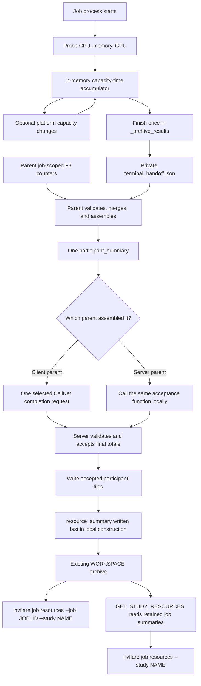
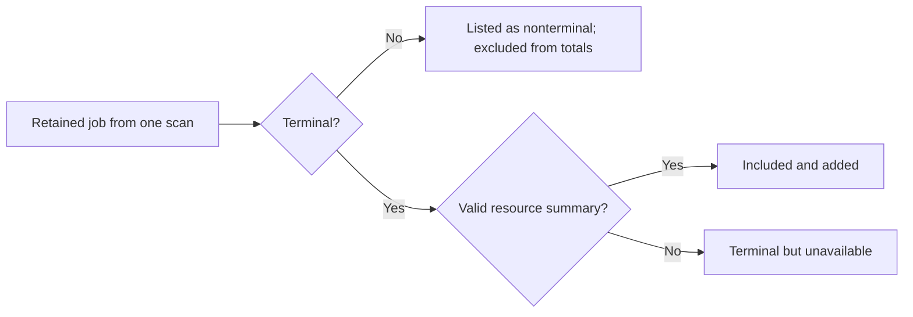

# From one final participant report to job and study totals

This document follows the data from one job process to the two user views:
one job and all retained jobs in a study.

This is the selected Phase 1 design mapped onto today's NVFlare processes. The
production subset is implemented; parent F3, retries, and other target-only
behavior remain identified as such.

## The complete flow



Only `participant_summary` and `resource_summary` are retained in the archived
`WORKSPACE`. The initial probe and any
capacity-change intervals stay in memory. The private terminal handoff is
written only as temporary process-to-parent state. The parent deletes it after
assembly, so it never enters the final resource namespace or archived workspace.

## Operational collection map

The implementation does not run shell commands to collect these values. It
uses Python/OS/CUDA APIs and parses kernel interfaces directly. Commands such
as `taskset`, `getconf`, `lscpu`, `nvidia-smi`, and `df` in the
[implementation plan](../../docs/design/job_resource_statistics_implementation_plan.md#7-exact-collection-rules)
are troubleshooting aids for an operator, not production collectors.

| Value | Where and when | Production source | What happens next |
| --- | --- | --- | --- |
| CPU capacity and model | CJ or SJ, immediately after `Workspace` exists and before NVFlare enables job custom imports | `os.sched_getaffinity(0)`; the process cgroup resolved from `/proc/self/cgroup` and `/proc/self/mountinfo`; cgroup v2 `cpu.max` and `cpuset.cpus.effective`, or v1 `cpu.cfs_quota_us`, `cpu.cfs_period_us`, `cpuset.effective_cpus`/`cpuset.cpus`; `os.sysconf("SC_NPROCESSORS_ONLN")`; `platform.machine()` and homogeneous affinity-visible records in `/proc/cpuinfo` | The selected capacity and evidence start an in-memory interval. No startup file or message is produced. |
| Memory capacity | Same startup hook as CPU | `os.sysconf("SC_PHYS_PAGES") * os.sysconf("SC_PAGE_SIZE")`; the tightest finite ancestor `memory.max` on cgroup v2 or `memory.limit_in_bytes` on cgroup v1 | The selected capacity starts the same in-memory interval. Swap is not added. |
| GPU capacity and model | Same startup hook as CPU | CUDA Runtime enumeration is the only count authority; the CUDA Driver API supplies validated device identity and NVML may enrich only those devices | The production probe is implemented and was verified with CUDA 13 and an NVIDIA L40G on Colossus. A failed CUDA enumeration remains unavailable rather than being inferred from `CUDA_VISIBLE_DEVICES` or `nvidia-smi`; broader CUDA-version, multi-GPU, and MIG coverage remains future validation. |
| Elapsed time | Start hook, any platform resource-change call, and `_archive_results()` | A monotonic nanosecond clock, converted to seconds with at most nine fractional digits | Each closed interval contributes CPU unit-seconds, memory byte-seconds, and GPU instance-seconds to the in-memory accumulator. |
| Workspace-filesystem capacity | CJ or SJ `_archive_results()`, once at finalization | `os.statvfs(Workspace.get_run_dir(job_id))`; capacity is `f_blocks * f_frsize` | One terminal observation enters the private handoff. It is never added across participants or jobs. |
| Retained-content bytes | CJ or SJ `_archive_results()`, once at finalization | A bounded retained-result set supplied by an existing workflow owner | The rule is fixed, but the authoritative set is not yet bound for every workflow. An unbound workflow reports unavailable; NVFlare does not scan the workspace or guess filenames. |
| Child F3 counters | CJ or SJ throughout the run, frozen in `_archive_results()` | Sender-side acceptance/local-delivery instrumentation for the allowlisted job traffic classes | Exact production provenance and task/stream correlation call sites remain open. Unproven coverage is partial or unavailable. |
| Parent F3 counters | CP or SP from before deployment/forwarding until after `job_handle.wait()` | The same sender-side instrumentation in the parent; admission closes, admitted callbacks drain for at most five seconds, then counters freeze | The parent adds non-overlapping child and parent sender hops before it builds the public report. |

CJ means client job process, CP client parent, SJ server job process, and SP
server parent. The exact current-code hook map is in
[Phase 1 integration with current code](CURRENT_CODE_INTEGRATION.md#exact-current-lifecycle).
The unresolved production work is kept separately in
[Remaining resource-statistics decisions](GAPS.md).

## Stage 1: one in-memory accumulator

At job-process startup, NVFlare observes the CPU, memory, and CUDA-validated
GPU capacity visible inside that environment and starts a monotonic clock.

For each private interval:

```text
CPU contribution    = visible CPU units × elapsed seconds
memory contribution = visible memory bytes × elapsed seconds
GPU contribution    = visible GPU instances × elapsed seconds
```

The accumulator adds contributions with checked arithmetic. CPU groups retain
the evidence/model grouping defined by the schema. GPU groups retain device
kind and model. Memory has one byte-seconds total.

Each private interval product is rounded at most once to nine fractional
digits using round-half-even before exact-decimal addition. The final JSON
uses canonical decimal strings, not binary floats.

Current NVFlare code does not announce a mid-process resource change, so the
current adapter assumes the initial capacity lasts until finalization in one
CJ or SJ process. If capacity changes while that process remains alive, a
platform call first integrates the previous capacity through the change time,
then installs the new capacity.

If a future execution design replaces workers or moves task execution to
another process, this in-process adapter must be replaced or its accumulated
state carried forward by a platform component spanning the participant's
logical work. The one persisted report and both rollups remain unchanged; this
design does not select the future owner or handoff.

The current private interval includes idle waits inside the job process. It is
visible process capacity-time, not active-task time or utilization.

The accumulator must never sample only at the end and multiply that snapshot
by the whole duration. That would be wrong as soon as a GPU is acquired,
released, or reconfigured during the job.

## Stage 2: write one private terminal handoff

`_archive_results()` finishes the accumulator and writes a bounded private
handoff with four child-derived facts:

- accumulated CPU, memory, and GPU resource time;
- the visible capacity of the filesystem containing the existing job
  workspace;
- bytes in an authoritative bounded retained-result set; and
- final child-process F3 sender counters.

The handoff has a fixed internal version and kind plus `resource_time`,
`workspace_filesystem`, `retained_content`, and `child_f3`. It is temporary
platform handoff state, not a public schema record.

The child writes it atomically at the fixed path
`<workspace>/<job_id>/resource_stats/staging/terminal_handoff.json`. The parent
reads only that bounded, regular, non-symlink file after `job_handle.wait()`.
Process, Docker, and Slurm launchers already expose the job workspace at the
parent-visible run directory. Kubernetes already returns and extracts its
result-workspace ZIP before the job handle completes. The design reuses those
paths; it adds no mount, launcher argument, privilege, or configuration. After
validation and assembly, the parent deletes the staging directory.

## Stage 3: assemble and deliver one participant summary

After `job_handle.wait()`, CP or SP bounds and strictly validates the private
handoff. It stops new included parent-process F3 traffic, drains admitted
callbacks for at most five seconds, freezes the parent counters, and adds
distinct child and parent sender hops. It then builds exactly one public
report:

```text
participant_summary
├── schema_version
├── kind
├── job_id
├── participant_name
├── reported_at
├── resource_time
│   ├── status
│   ├── issues (partial/unavailable only)
│   ├── measured_seconds
│   ├── cpu.groups[].unit_seconds
│   ├── memory.byte_seconds
│   └── gpu.groups[].instance_seconds
├── workspace_filesystem
│   ├── status
│   └── capacity_bytes (reported only)
├── retained_content
└── f3
```

There is no public startup record, final-capacity comparison, attempt ID,
environment key, end reason, stability flag, or raw period list.

If the child handoff is missing, oversized, or invalid, the parent still
builds a valid report: child-derived objects are unavailable and usable parent
F3 is partial. The private handoff is removed after assembly. CP sends the
exact report bytes using exactly one completion transport:

- Option A extends `REPORT_JOB_FAILURE` / `report_job_failure` with the
  optional resource report.
- Option B replaces that request with versioned `REPORT_JOB_COMPLETION` /
  `report_job_completion`; its combined envelope contains exact integer
  `protocol_version: 1` and otherwise the same completion and report members.

Retries remain on the selected topic and reuse identical report bytes. There
is no dual-send mode and no operator setting for choosing the option. Both
options feed the same authentication, acceptance, cutoff, reply, and storage
logic. Option B fixes only the stale-name/handler-ownership objection; it does
not remove validation, direct byte comparison, filesystem writes, or retries
from the critical completion path. If lifecycle control and resource data must
use separate paths, neither option suffices. SP passes its locally assembled
bytes through the same acceptance function without a loopback request.

For CP, the selected request goes to `FQCN.ROOT_SERVER` on
`CellChannel.SERVER_MAIN` (`task`). Option A uses `report_job_failure`; option
B uses `report_job_completion`. The existing request timeout is five seconds.
Current CP frees launcher-managed compute resources and then makes one
application-level send. A target retry proposal permits at most three attempts,
one second apart, with the same outcome and canonical report bytes; it must
preserve that resource-release ordering.

`resource_time.status` is one status for CPU, memory, and GPU together:

| Status | Meaning |
| --- | --- |
| `reported` | All three dimensions were measured for the accumulator's covered duration. |
| `partial` | Some valid capacity-time exists, but a dimension or interval is missing. |
| `unavailable` | The accumulator produced no usable capacity-time. |

One status makes the common case easy to read. An issue list appears only for
partial or unavailable results and explains missing coverage without
repeating status on every resource branch.

## Stage 4: accept the participant report

The server validates:

- sender and expected job/participant-name binding;
- byte limit and deterministic canonical-byte form;
- strict JSON and schema;
- semantic bounds, units, grouping, and canonical numbers; and
- that a report contains only the selected final fields.

The first valid canonical byte sequence wins. A byte-for-byte retry is a duplicate.
Different valid canonical bytes are a conflict. New data after cutoff is too
late.

Under the per-job acceptance lock, the server compares against any bytes already
accepted for that participant and retains the first valid canonical bytes in
the bounded live parent ledger before it acknowledges `accepted`. It does not
write the participant file at acceptance. The normal cutoff is the existing
wait for client terminal outcomes (currently 900 seconds by default); abort or
server failure closes it immediately. There is no separate resource-report
window.

The server cannot recompute `resource_time` because the simplified report does
not contain the accumulator's private intervals. It accepts those totals as an
authenticated participant self-report after validation. This is the main
tradeoff for removing start/end records.

## Stage 5: build one job summary

The server starts with the participant list fixed at job start, not the set of
reports that happened to arrive. Every selected client and the server therefore
appears as `accepted`, `missing`, `invalid`, or `disabled`.

For accepted reports, the server adds only additive fields:

```text
job measured seconds       = Σ participant measured seconds
job CPU unit-seconds       = Σ participant CPU unit-seconds
job memory byte-seconds    = Σ participant memory byte-seconds
job GPU instance-seconds   = Σ participant GPU instance-seconds
job retained bytes         = Σ participant retained bytes
job F3 remote-accepted bytes/messages = Σ participant remote-accepted values
```

The job summary groups compatible CPU and GPU entries before adding them. It
preserves the coverage status and issue information needed to explain missing
or partial contributions.

Added `measured_seconds` is participant time. Parallel participants make it
larger than the job's wall-clock duration; that is expected.

The server does not add `workspace_filesystem.capacity_bytes`. Several
participants can observe the same shared filesystem, so such a total would be
misleading. Each participant's one terminal observation remains available in
`--site` detail.

After checked addition, the server writes:

```text
resource_stats/participants/<participant_name>.json
resource_stats/resource_summary.json
```

Accepted participant files are written and fsynced first.
`resource_summary.json` is then written and fsynced last as the publication
marker. The normal job finalizer stores this directory only inside the existing
server `WORKSPACE` archive. This describes the parent-owned local construction
sequence only. The archiver may choose any ZIP member order, and the reader
does not depend on that order.

## Stage 6: show one job

```bash
nvflare job resources --job JOB_ID
nvflare job resources --job JOB_ID --study STUDY_NAME
nvflare job resources --job JOB_ID --study STUDY_NAME --site SITE_NAME
nvflare job resources --job JOB_ID --study STUDY_NAME --format json
```

`--job` alone uses the existing `default` study. Combining `--job` and
`--study` selects the job from the named study.

The command does not search across studies. NVFlare binds job visibility to
the authenticated session's study, so a job in another study intentionally
appears not found, matching the other job commands.

The authenticated `GET_JOB_RESOURCES` handler stages the existing `WORKSPACE`
and treats `resource_summary.json` as the publication marker. It validates the
summary, derives the exact accepted participant filenames, requires exactly
that `resource_stats/` namespace, and returns the validated summary. With
`--site`, it additionally validates the selected participant's schema,
identity, and copied values before returning that detail record. A missing
summary leaves any orphan participant files unpublished. The remote CLI never
reads an arbitrary server path. ZIP CRC detects accidental corruption in a
member when it is read but is not a cryptographic integrity or signing
mechanism.

Default output uses the job summary. `--site` also opens the one accepted
participant record selected through the trusted participant map.

## Stage 7: show all retained jobs in a study

```bash
nvflare job resources --study STUDY_NAME
nvflare job resources --study STUDY_NAME --format json
```

`--study` without `--job` selects all retained jobs in the named study. The
bare `nvflare job resources` command shows help, and `--site` requires `--job`.

`GET_STUDY_RESOURCES` uses current active-study authorization and makes one
pass over the retained jobs visible to the caller. It keeps the IDs and
statuses returned by that pass, then classifies jobs without rescanning:



Here, terminal uses the existing job-CLI predicate: a status beginning
`FINISHED:`, or `FINISHED_OK`, `FINISHED_EXCEPTION`, `ABORTED`, `ABANDONED`,
or `FAILED` for retained legacy jobs. The status recorded by the scan is not
changed while the server reads that row's archive.

For included jobs:

```text
study measured seconds       = Σ included job measured seconds
study CPU unit-seconds       = Σ included job CPU unit-seconds
study memory byte-seconds    = Σ included job memory byte-seconds
study GPU instance-seconds   = Σ included job GPU instance-seconds
study retained bytes         = Σ included job retained bytes
study F3 remote-accepted bytes/messages = Σ included job remote-accepted values
```

Workspace-filesystem capacity is never part of the study total.

Study `measured_seconds` is likewise additive across jobs and participants.
Overlapping jobs are counted independently; the value is not study wall time.

The response includes a per-job status list plus included, unavailable, and
nonterminal-excluded counts. This makes the coverage visible instead of hiding
terminal jobs whose archives are absent or invalid.

A job that finishes after its scanned status was recorded remains nonterminal
in this response and is eligible on the next query.

If the scan returns more than 10,000 jobs, v1 fails before reading
archives and returns no rows or totals. It does not page a subtotal that could
be mistaken for the full study.

The study result is calculated on demand and is not stored. It covers retained
jobs only. Deleted jobs are not recoverable, and an active job contributes
nothing until it becomes terminal. This is a convenience rollup, not a billing
or audit ledger.

See the generated [study text](schema/golden/v1/finalized_job/cli/resources-study.txt),
[study JSON](schema/golden/v1/finalized_job/cli/resources-study.json), and
[canonical response](schema/golden/v1/study_summary.json).

## Worked capacity-change example

Suppose a participant has:

- 16 CPU units and 128 GiB visible for 10 minutes;
- two A100 GPUs for the first four minutes;
- no GPU for the next two minutes; and
- four A100 GPUs for the last four minutes.

The private accumulator produces:

```text
measured_seconds = 600
CPU unit-seconds = 16 × 600 = 9,600
memory byte-seconds = 128 GiB × 600
GPU instance-seconds = (2 × 240) + (0 × 120) + (4 × 240) = 1,440
```

The final report contains those totals. It does not contain the three private
GPU intervals. A server can validate their bounds and representation but
cannot reconstruct or independently verify the 1,440 instance-seconds.

For this complete participant, `1,440 / 600 = 2.4` is the time-weighted
average visible GPU count. It does not recover the sequence of two GPUs, then
zero, then four. CPU and memory divide back to 16 units and 128 GiB only
because they stayed constant throughout the example. Phase 1 does not retain
the private capacity snapshots; a bounded periodic history is deferred to a
future Phase 2 contract.

Current code reports the capacity observed at startup for the whole measured
duration. Any future dynamic-allocation implementation must replace that
assumption with change notifications or a different accumulator owner that
preserves the same terminal contract.

## One-copy rule

The live server workspace is the construction location. The archived
`WORKSPACE` is the retained copy. Job and study queries read that same archive.

There is no second job-store component, study summary file, metrics database,
or CLI-side durable cache in Phase 1. A future performance optimization may
add a bounded archive-member API or ephemeral server cache, but it must not
create two authoritative copies.
