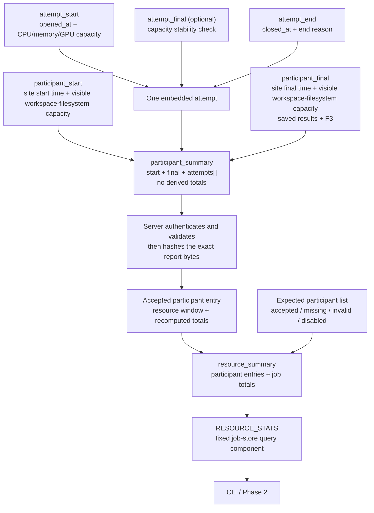

# From observations to the final job summary

This document shows how one site's resource observations become a final job
result. It also explains the two different start/final pairs and the purpose of
the `RESOURCE_STATS` job-store component.

## The complete flow



An attempt does not become a site report by itself. At site completion, NVFlare
combines the site-level start and final facts with zero or more measurement
periods into one `participant_summary`.

## Two different start/final pairs

| Records | Scope | How they are used |
| --- | --- | --- |
| `participant_start` and `participant_final` | The site's whole participation in the job | Bound the site lifecycle and retain the two visible workspace-filesystem capacity observations. `participant_final` also contains saved-result bytes and F3 counters. |
| `attempt_start`, optional `attempt_final`, and `attempt_end` | One CPU, memory, and GPU measurement period | Start supplies capacity, end supplies duration, and optional final checks whether the starting capacity remained stable. |

The participant timestamps do not define compute time. They ensure that every
measurement period falls inside the site's lifecycle. The visible
workspace-filesystem capacity observations remain point-in-time facts; they
are not multiplied or summed.

## Stage 1: assemble one site report

The small start, final, and end records are logical fragments. They may be held
in memory or existing NVFlare state and never exist as separate files.

The site assembles them as follows:

| Logical fragment | Location in `participant_summary` |
| --- | --- |
| `participant_start.observed_at` and `.storage` | `start` |
| `attempt_start.opened_at` and `.capacity` | one `attempts[]` entry's `opened_at` and `start` |
| optional `attempt_final.capacity` | the same entry's optional `final` |
| `attempt_end.closed_at` and `.reason` | the same entry's `end` |
| `participant_final.observed_at`, `.storage`, `.retained_content`, and `.f3` | `final` |

The attempt fragments are correlated by their job, participant, attempt ID, and
measurement-scope key. Repeated identity fields are omitted inside the embedded
attempt. Attempts must have unique IDs, fit inside the participant lifecycle,
and not overlap when they use the same measurement-scope key.

The resulting record has this shape:

```text
participant_summary
├── participant_key
├── start
│   ├── observed_at
│   └── storage.capacity_bytes
├── attempts[]
│   ├── attempt_id
│   ├── environment_key
│   ├── opened_at
│   ├── start.capacity
│   ├── optional final.capacity
│   └── end
└── final
    ├── observed_at
    ├── storage.capacity_bytes
    ├── retained_content
    └── f3
```

`participant_summary` is the detailed site report. It intentionally contains
no derived totals.

The standalone `participant_id` and role are not repeated in this report. The
job-scoped `participant_key` identifies it. When the server accepts the report,
trusted expected-participant state supplies the display ID and role.

## Stage 2: derive one participant's totals

The server validates the complete `participant_summary` before using it. It
then derives every participant total rather than trusting totals supplied by
the site.

For each measurement period:

```text
duration = end.closed_at - opened_at

CPU time    = start CPU units × duration
memory time = start memory bytes × duration
GPU time    = start GPU count × duration
```

The optional attempt final is stability evidence only. It is not averaged with
the start, does not replace the start, and does not define duration. A missing,
unavailable, or numerically different final makes that resource's derived
total partial, but the valid start-based contribution remains.

The server sums all measurement periods and records:

- `resource_window_seconds`, the sum of their durations;
- CPU unit-seconds, grouped by CPU model and architecture;
- memory byte-seconds;
- GPU instance-seconds, grouped by GPU kind and optional hardware metadata;
- `participant_final.retained_content.bytes`, once; and
- `participant_final.f3.remote_accepted`, once.

The other F3 counters remain in the archived site report. The two visible
workspace-filesystem capacity observations also remain there and do not enter
participant totals.

For each total, the derived status is:

- `reported` when numeric evidence is complete;
- `partial` when a numeric contribution exists but some evidence is
  incomplete; or
- `unavailable` when no numeric contribution exists.

The accepted participant entry in `resource_summary` contains the trusted
display identity, receipt time, exact report digest, resource window, and
recomputed totals:

```json
{
  "participant_id": "site-1",
  "participant_key": "sha256-...",
  "role": "client",
  "status": "accepted",
  "received_at": "2026-09-09T14:37:03.1Z",
  "summary_sha256": "...",
  "resource_window_seconds": "2223",
  "totals": {
    "cpu": {},
    "memory": {},
    "gpu": {},
    "retained_content": {},
    "f3": {}
  }
}
```

`summary_sha256` is the SHA-256 digest of the exact accepted
`participant_summary` bytes. The compact entry does not duplicate the raw
start, final, or attempt records.

## Stage 3: derive the job result

The server starts with the independently known list of every client and server
expected for the job. At the fixed report cutoff, it classifies each one as
`accepted`, `missing`, `invalid`, or `disabled`.

Only accepted numeric participant totals contribute to job totals. CPU and GPU
values preserve their hardware groups; memory, saved-result bytes, and accepted
remote F3 counters are summed directly.

A job total is:

- `reported` only when every expected participant is accepted and every
  accepted contribution for that total is reported;
- `partial` when at least one numeric contribution exists but report coverage
  or measurement evidence is incomplete; or
- `unavailable` when no numeric contribution exists.

The server validates that the stored job totals exactly equal this deterministic
result. Raw attempts and visible workspace-filesystem capacity observations
remain in the archived participant reports rather than being copied into
`resource_summary`.

## Worked partial example

The generated `site-2` report has two measured periods:

```text
Period 1:   300 seconds × 16 CPU units × 128 GiB memory × 2 GPUs
Gap:        300 seconds, not measured and not counted
Period 2: 1,623 seconds × 32 CPU units × 192 GiB memory × 4 GPUs
```

The participant rollup is:

```text
Resource window = 300 + 1,623 = 1,923 seconds
CPU total       = 16×300 + 32×1,623 = 56,736 unit-seconds
GPU total       = 2×300 + 4×1,623   = 7,092 instance-seconds
Memory total    = 375,826,818,269,184 byte-seconds
```

The first period has no final stability observation. The numeric contributions
remain, but the CPU, memory, and GPU totals are partial. Saved-result data is
unavailable for this participant, while its F3 remote-accepted counter is added
once.

See the complete [site-2 report](schema/golden/v1/participant_summary_partial_periods.json)
and its compact entry in the [job summary](schema/golden/v1/resource_summary.json).

## Why `RESOURCE_STATS` exists

The proposed storage design has two views of the same finalized job summary:

```text
server job workspace                         job store
resource_stats/                              jobs/<job_id>/
├── resource_summary.json                    └── RESOURCE_STATS
├── manifest.json
└── participants/
    └── <participant_key>.json
```

`resource_summary.json` belongs to the self-contained server archive. It sits
beside the exact accepted participant reports and the manifest that hashes the
whole bundle. That layout supports validation, investigation, and provenance.

`RESOURCE_STATS` is not another record type or JSON format. It is the fixed
name of a job-store component whose payload is the exact serialized
`resource_summary.json`.

It gives the CLI and the optional Phase 2 publisher a stable, small query
surface. Existing job storage can package the completed run workspace for
download. Without this component, a reader could have to retrieve and unpack
that larger workspace simply to obtain the final summary. The component also
uses normal job-storage authorization, retention, and deletion behavior; it
does not require callers to know a server filesystem path.

The component is not another rollup or a different representation. Its bytes
must be identical to `resource_summary.json`. Only the reconciled summary is
published there; the detailed participant reports are not.

`RESOURCE_STATS` is a proposed exact component name, not a generic component
prefix. The production integration would add narrow `save_resource_stats` and
`get_resource_stats` APIs. This avoids letting callers invent arbitrary job
component names.

The data model needs one logical final summary. The prototype uses a physical
copy to make the archive and query responsibilities explicit. Physical
duplication is not essential: production storage could expose one object
through both views, provided `get_resource_stats` returns the exact validated
summary bytes.

## What is specified and what remains open

The schema, validator, formulas, golden records, archive relationships, and
job-total reconciliation are executable today in this prototype.

The production NVFlare component that collects logical fragments, assembles the
final `participant_summary`, and sends it to the server is still an open Phase
1 implementation decision. The prototype's canonical generator constructs the
completed site report directly and then extracts standalone fragment examples;
it does not yet implement a production fragment reducer. Duplicate and conflict
handling during that assembly therefore still needs to be specified with the
chosen integration point.

The production integration must also define how it publishes the archive and
query component consistently. It should expose `RESOURCE_STATS` only after the
final bundle has passed validation. A missing or mismatched query component
must be treated as unavailable or corrupt rather than as an alternative result.

These unresolved integration choices are tracked in the authoritative
[open-decision list](GAPS.md).
